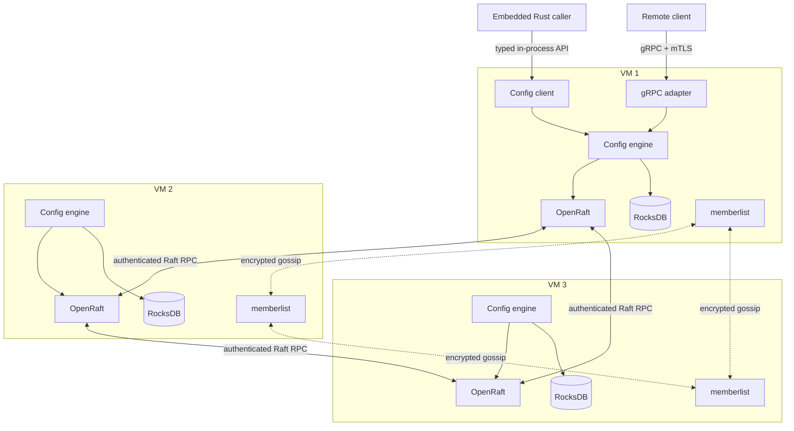
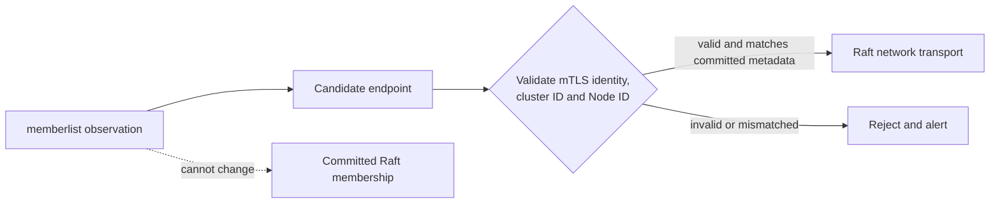
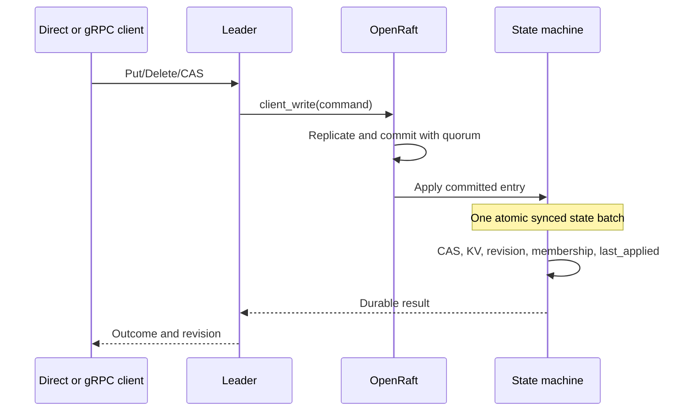

# Distributed Configuration Service in Rust — Design Specification

**Status:** Approved target architecture; release scope revised to milestones M0–M3  
**Date:** 2026-09-17  
**First release:** Durable, authenticated three-node core on VMs; watches explicitly excluded  
**Target architecture:** Production-capable small control plane after post-release hardening  
**Core libraries:** OpenRaft `=0.9.25`, `memberlist = "=0.8.5"`, Tokio, tonic/Protobuf, RocksDB

## 1. Executive decision

Build the system in gated milestones. The **first shippable release is M0–M3 only**:

- one static OpenRaft group with three voters;
- a deterministic byte-key/byte-value state machine;
- global revisions and per-key modification revisions;
- `Get`, bounded one-response prefix `List`, `Put`, `Delete`, and revision-based CAS;
- durable RocksDB-backed vote, log, and state-machine storage with restart correctness;
- leader-linearizable reads and quorum-committed writes;
- a stable Rust in-process client API and external gRPC/Protobuf API over mTLS;
- thin Rust full-node embedding sufficient to start, stop, and obtain a direct client;
- day-zero encrypted `memberlist` for advisory peer hints and telemetry;
- stable cluster and Node identity, controlled static formation, typed unknown-outcome behavior, and a static deployment allowlist.

The first release explicitly excludes watches, deduplication, dynamic membership, snapshots, backups, pagination cursors, distributed RBAC policy, and an admin API. These are not partially implemented or exposed.

The target architecture later adds resumable watches, full lifecycle operations, backup/restore, dynamic membership tooling, and production hardening. OpenRaft remains the only authority for membership, leadership, ordering, and committed configuration. Gossip is always advisory.

## 2. Goals and limits

### 2.1 Release validation envelope

The first release must prove correctness and controlled remote use. It does not claim the final production capacity envelope.

First-release validation targets:

- exactly three statically configured voters;
- durable restart correctness on the chosen VM disk class;
- operation with one stopped voter while the remaining two communicate;
- deterministic behavior at modest functional-test load;
- bounded one-response prefix List;
- direct and gRPC client equivalence;
- gossip disabled, partitioned, or wrong without affecting Raft correctness.

Post-release capacity targets remain:

- up to 100,000 live keys;
- up to 1 GiB of live KV data;
- approximately 100 state-changing writes per second;
- up to 1,000 concurrent watch streams after the watch milestone.

These are validation targets, not guarantees until the relevant load, crash, recovery, and fault gates pass on the intended infrastructure.

### 2.2 First-release goals

1. Linearizable configuration reads and quorum-committed writes.
2. Optimistic concurrency through per-key revision CAS.
3. Durable vote, log, state, and identity across restart.
4. Clear behavior during partitions, leader changes, invalid identities, disk failures, and unknown mutation outcomes.
5. Equivalent semantics for embedded direct and remote gRPC callers.
6. Stable public boundaries that do not expose OpenRaft, RocksDB, tonic, or gossip types.
7. Day-zero gossip that remains non-authoritative and optional for Raft liveness.

### 2.3 First-release exclusions

- **All watch APIs and watch delivery.** Resumable watches are the first post-release correctness milestone, never a partial release feature.
- Multi-key transactions.
- Leases, TTL deletion, sessions, locks, or election APIs.
- Revision-pinned pagination cursors; List is one bounded response.
- Request deduplication or exactly-once claims.
- Dynamic voter or learner management and replacement tooling.
- State-machine snapshots, log purging, backup, or restore.
- Distributed/signed RBAC policy lifecycle; use a static deployment allowlist.
- Public admin gRPC API.
- Stale follower reads.
- Multi-region consensus, federation, sharding, or multiple Raft groups.
- C ABI or non-Rust in-process embedding.
- Production-capable or secrets-manager claims.

The later sections specify the target design. Section 21 is authoritative about which parts are implemented in each milestone.

## 3. Architecture



### 3.1 Workspace boundaries

| Crate | Responsibility |
|---|---|
| `config-core` | Stable requests, responses, records, revisions, errors, authorization contracts, versioned replicated commands |
| `config-storage` | M2 vote/log/state durability; post-release snapshots and recovery |
| `config-engine` | OpenRaft lifecycle, deterministic reads/writes; post-release watch journal and fan-out |
| `config-gossip` | `memberlist` adapter, candidate endpoints, advisory health and metadata |
| `config-client` | Stable Rust client trait, direct and remote implementations, leader retry |
| `config-grpc` | First-release client/peer Protobuf mapping and mTLS; post-release admin server |
| `config-server` | Standalone executable, configuration loading, runtime and process supervision |

Dependency direction is inward toward `config-core`. Public APIs must not expose OpenRaft, RocksDB, tonic, or `memberlist` types.

### 3.2 Authority rules

- Committed Raft membership is authoritative for voters, learners, and peer endpoint metadata.
- Committed Raft entries are authoritative for configuration state.
- Seed files, DNS, gossip, health checks, and leader hints are untrusted routing hints.
- Every peer endpoint learned through gossip is authenticated and bound to the expected cluster ID and Node ID before Raft uses it.
- A gossip observation never directly changes Raft membership or serves configuration data.

## 4. Deployment and identity

### 4.1 Node placement

Run exactly three voters on independent hosts, racks, zones, power domains, and durable volumes where the infrastructure permits. A deployment that shares a correlated failure domain does not meet the intended one-failure availability target.

### 4.2 Stable identity

Each cluster has:

- immutable logical service identity;
- `cluster_id`;
- `recovery_epoch`;
- three stable, never-reused Node IDs for the current voters;
- certificate-bound peer identities;
- a signed bootstrap manifest version.

A data directory is permanently bound to its cluster ID, recovery epoch, and Node ID. A mismatch fails startup. Cloning a node data directory or identity is forbidden.

### 4.3 Bootstrap manifest

The signed deployment manifest contains:

- cluster ID and recovery epoch;
- manifest version and expiration;
- initial Node IDs and seed endpoints;
- peer trust roots and allowed identity mapping;
- gossip seeds and gossip protocol version;
- signing-key identity.

The manifest only provides first contact and identity expectations. After formation, committed Raft membership is authoritative. Manifest rollback, signing-key rotation, revocation, and expiration are explicit deployment procedures.

## 5. Gossip from day zero

### 5.1 Choice

Use the Rust `memberlist` crate by al8n, pinned to `=0.8.5` with only the audited TCP/UDP, encryption, metrics, and Tokio runtime features enabled; record the final feature list in `Cargo.toml` and `Cargo.lock`. Do not use experimental QUIC in the first release. Changing the version or feature set requires dependency, wire-compatibility, security, and mixed-version tests.

### 5.2 Advertised data

Gossip may advertise only non-authoritative node metadata:

- cluster ID;
- stable Node ID;
- candidate peer and client endpoints;
- software and protocol versions;
- zone or failure-domain label;
- local `alive`, `suspect`, and `dead` observations;
- coarse operational capabilities.

Do not gossip configuration values, authorization policy, secrets, votes, membership decisions, or snapshot contents.

### 5.3 Safety boundary



A `dead` observation produces telemetry or an operator proposal. It never removes a voter. Static multi-seed bootstrap remains mandatory so gossip is not its own sole bootstrap dependency.

### 5.4 Gossip operations

- Separate gossip ports, encryption keys, credentials, and rate limits from Raft and client traffic.
- Support overlapping-key rotation.
- Export join, leave, suspicion, probe latency, queue, drop, and endpoint-mismatch metrics.
- Test partitions, one-way loss, process pauses, stale packets, duplicate identities, poisoned endpoints, unavailable seeds, and mixed-version rollout.
- Document that this Rust library is not wire-compatible with HashiCorp Go `memberlist` clusters.

## 6. Embedding model

### 6.1 Stable Rust API

The central semantic interface is transport-independent:

```rust
#[async_trait]
pub trait ConfigStore: Send + Sync {
    async fn get(&self, request: GetRequest) -> Result<GetResponse, ConfigError>;
    async fn list(&self, request: ListRequest) -> Result<ListResponse, ConfigError>;
    async fn put(&self, request: PutRequest) -> Result<MutationResponse, ConfigError>;
    async fn delete(&self, request: DeleteRequest) -> Result<MutationResponse, ConfigError>;
}
```

`Watch` is deliberately absent from the first-release trait. It is added only in the first post-release stream-correctness milestone after its journal, replay, compaction, failover, and resource-isolation gates pass.

Two implementations provide identical semantics:

- `DirectClient` calls an embedded engine through typed internal interfaces.
- `GrpcClient` calls a remote node and follows authenticated leader hints.

A direct client does not bypass Raft, authentication/authorization hooks, leader confirmation, CAS, or revision allocation. Persistent request deduplication is not present in the first release.

### 6.2 Normative first-release API schema

The implementation plan must materialize the following normative shape as versioned Protobuf. Field numbers shown here are reserved and must never be reused. Watch field numbers are not allocated until the post-release watch design is implemented.

```protobuf
service ConfigService {
  rpc Get(GetRequest) returns (GetResponse);
  rpc List(ListRequest) returns (ListResponse);
  rpc Put(PutRequest) returns (MutationResponse);
  rpc Delete(DeleteRequest) returns (MutationResponse);
}

message Record { bytes key = 1; bytes value = 2; uint64 create_revision = 3; uint64 mod_revision = 4; }
message GetRequest { bytes key = 1; }
message GetResponse { optional Record record = 1; uint64 read_revision = 2; }
message ListRequest { bytes prefix = 1; uint32 max_items = 2; uint64 max_bytes = 3; }
message ListResponse { repeated Record records = 1; uint64 read_revision = 2; bool truncated = 3; }
message PutRequest { bytes key = 1; bytes value = 2; optional uint64 expected_mod_revision = 3; }
message DeleteRequest { bytes key = 1; optional uint64 expected_mod_revision = 2; }
enum MutationOutcome { MUTATION_OUTCOME_UNSPECIFIED = 0; APPLIED = 1; CONFLICT = 2; NOT_FOUND = 3; }
message MutationResponse { MutationOutcome outcome = 1; uint64 revision = 2; bool exists = 3; uint64 current_mod_revision = 4; }
```

A truncated List is not silently paginated. The caller narrows its prefix or increases limits within the server-enforced caps. Revision-pinned continuation tokens are post-release scope.

The authenticated principal is derived only from the mTLS transport identity, or from a non-forgeable scoped handle for a direct embedded client. It is never accepted from a Protobuf field.

Normative transport mapping:

| Semantic result | gRPC status |
|---|---|
| Successful mutation, including `CONFLICT` or `NOT_FOUND` outcome | `OK` with `MutationResponse` |
| `NotLeader` | `FAILED_PRECONDITION` plus authenticated leader-hint metadata |
| `Unavailable` | `UNAVAILABLE` |
| Unknown mutation outcome after deadline | `DEADLINE_EXCEEDED` |
| Resource limit | `RESOURCE_EXHAUSTED` |
| Invalid request | `INVALID_ARGUMENT` |
| Authentication/authorization | `UNAUTHENTICATED` / `PERMISSION_DENIED` |
| Fatal local storage | `INTERNAL`, node becomes unready |

Post-release watch transport mappings and stream termination semantics are defined in Section 11 and are not part of the first-release Protobuf service.

### 6.3 Full-node embedding

An embedding application may build and start a `ConfigNode`. It owns:

- startup and shutdown timing;
- storage directory selection;
- listener configuration;
- logging and metrics sinks;
- the Tokio runtime by default;
- CPU, memory, file descriptor, disk, and thread budgets.

The library owns and supervises:

- Raft tasks;
- peer networking;
- gossip tasks;
- RocksDB access serialization;
- graceful internal shutdown.

Snapshot jobs and watch dispatch are added only in their post-release milestones.

The library must not silently create a global Tokio runtime. The standalone binary creates its own runtime. Blocking RocksDB work uses bounded blocking executors and must not starve Raft timers.

### 6.4 Optional surfaces

| Surface | Full embedded voter/learner | Client-only embedding |
|---|---:|---:|
| Direct API | Required | Required |
| Raft peer listener | Required | No |
| Gossip listener | Required | Optional discovery client only |
| Client gRPC listener | Optional | No |
| Restricted admin listener | Post-release | No |

Fatal node/storage health is delivered to the host through a health stream and join handle. Embedding shares the host process failure domain; the standalone server is preferred when process isolation matters.

## 7. Data and command model

### 7.1 Keys and values

Treat keys and values as opaque byte strings. Ordering is unsigned bytewise lexical order.

Initial enforced safety caps (subject to lowering after testing, never raising without load, disk-budget, snapshot, and recovery evidence):

- key: 1 KiB;
- value: 1 MiB;
- complete mutation request: 2 MiB;
- List page: at most 1,000 keys and 8 MiB;
- watch event payload: at most the configured value limit plus metadata.

These are starting caps, not demonstrated capacity guarantees. Large blobs belong in object storage; this service stores references.

### 7.2 Record metadata

```rust
struct Record {
    key: Bytes,
    value: Bytes,
    create_revision: u64,
    mod_revision: u64,
}
```

The state machine also stores:

- `cluster_revision`: increments once for each state-changing mutation;
- `last_applied`: durable OpenRaft log identity;
- current membership required by the OpenRaft state-machine contract.

The command apply path also deterministically constructs an internal `MutationEvent`, but M0–M3 do not retain or deliver it. Deduplication records and retained watch events are added only in their later milestones.

The public cluster revision is not the raw Raft log index. Membership, blank, and other internal log entries need not allocate a public revision.

### 7.3 Operations

#### Get

Returns a record or absence plus the linearizable read revision.

#### List

Returns up to the enforced item/byte caps under one prefix, in lexical order, plus a stable read revision and `truncated`. The first release has no continuation token; callers narrow the prefix when truncated.

#### Put

- Unconditional when `expected_mod_revision` is absent.
- Create-only when `expected_mod_revision == 0`.
- Conditional when it equals an existing key's `mod_revision`.
- A successful same-value Put is a state-changing mutation and allocates a revision and event.

#### Delete

- Unconditional when `expected_mod_revision` is absent.
- `expected_mod_revision == 0` is invalid for Delete; use unconditional Delete or a positive known revision.
- A missing key returns `NOT_FOUND`, including when a positive expected revision was supplied; it allocates no revision or event.
- An existing key with a mismatched positive revision returns `CONFLICT`; it allocates no revision or event.
- Successful deletion deterministically constructs an internal tombstone `MutationEvent` containing the key and deletion revision. M0–M3 do not retain or deliver it; M4 uses this representation for watches.

#### CAS outcome

A conditional mutation returns `APPLIED` or `CONFLICT` as an application outcome, not a transport failure. Conflict returns only `exists` and `current_mod_revision`; returning a value requires independent read permission.

### 7.4 Determinism

Replicated commands have a canonical, versioned encoding. State-machine apply must not use local wall clocks, randomness, unordered iteration, environment state, external network calls, or platform-dependent normalization. Validation and error outcomes are deterministic.

## 8. Writes and later request deduplication

### 8.1 First-release write path



The API returns success only after OpenRaft commit and durable state-machine application under the documented storage contract. A deadline may yield an unknown outcome. M0–M3 clients do not automatically replay mutations; they read authoritative state and use CAS to recover.

### 8.2 Post-release deduplication

Persistent request deduplication is not part of M0–M3. If client evidence justifies it in M5 or later, each mutation gains a client-generated `client_id` and `request_id`, with the effective key:

```text
(authenticated principal, client_id, request_id)
```

The original result is then persisted atomically with apply, subject to a bounded documented retention window. Even then, the guarantee is at-most-one application within that window, never universal exactly-once execution.

## 9. Storage design

### 9.1 OpenRaft version

Pin `openraft = "=0.9.25"` with `Cargo.lock`. OpenRaft 0.10 is alpha, its upgrade guide is incomplete, and OpenRaft remains pre-1.0. Treat all upgrades as migrations requiring compatibility and fault testing.

### 9.2 RocksDB layout

Use one RocksDB instance per node with separate column families:

| Column family | Contents |
|---|---|
| `raft_log` | Consecutive ordered Raft entries |
| `raft_meta` | Durable vote and log metadata |
| `kv` | Current materialized records |
| `state_meta` | Public revision, last-applied identity, membership |

The `events` and `dedup` column families are not created in M2. They are added through explicit later schema migrations when M4 watches or optional M5 deduplication begin.

The Rust implementations of `RaftLogStorage` and `RaftStateMachine` remain separate even when they share a physical database.

### 9.3 Required invariants

1. Votes are synchronously durable before `save_vote()` returns.
2. Log writes are serialized and contain no holes.
3. Accepted appended entries are readable on return.
4. A log-flushed notification fires only after the promised durable boundary.
5. A first-release state-machine apply atomically and synchronously persists KV changes, public revision, last-applied log identity, and membership changes. Later event or dedup records join that same atomic batch when their milestones are implemented.
6. Committed-but-unapplied entries are safely replayed after restart.
7. Disk-full, corruption, or uncertain sync failures make the node fatal/unready; the process never continues optimistically.
8. Storage options, WAL/sync behavior, VM volume durability, compaction budgets, and file descriptor/memory limits are version-pinned and benchmarked.

Atomic state-machine batches do not imply atomicity with separately invoked Raft log/vote operations. Correctness comes from OpenRaft's ordering contract plus durable, idempotent state-machine apply and restart replay.

## 10. Reads and pagination

### 10.1 Linearizable reads

All first-release reads are leader-linearizable. On OpenRaft 0.9.25 the leader calls `ensure_linearizable()`, which confirms current leadership through quorum communication and waits for state-machine application before the service reads local state. The exact pinned API and behavior must be verified by compile-time integration and partition tests.

A follower returns typed `NOT_LEADER` with a validated leader hint. A former leader unable to reach quorum returns retryable `UNAVAILABLE`; it must not serve a successful strict read.

### 10.2 First-release bounded List

The first release returns one leader-linearized response in unsigned bytewise lexical key order. The request supplies `max_items` and `max_bytes`, both capped by the server. The response includes `read_revision` and `truncated`. It does not expose a continuation token. A caller that receives `truncated=true` must narrow the requested prefix; the service does not pretend that multiple independent calls form one consistent snapshot.

Revision-pinned pagination and authenticated continuation tokens are M6 scope. The target design uses a short-lived RocksDB read snapshot bound to prefix, revision, cursor position, principal, policy version, token version, and expiry.

## 11. Post-release watch semantics

**Release boundary:** This entire section begins at M4, the first milestone after the M0–M3 release. No `Watch` Rust method, Protobuf RPC, event journal, compaction watermark, or best-effort preview is shipped earlier.

### 11.1 Contract

Watches are:

- leader-served;
- ordered by increasing public revision;
- at-least-once;
- resumable while the starting revision remains retained;
- terminated explicitly on leader loss, compaction, authorization change, or overload.

Clients deduplicate by `(key, revision, operation)`. They persist the highest fully processed revision and reconnect with `start_after_revision`.

### 11.2 Gap-free list-to-watch flow

1. `List(prefix)` returns a consistent snapshot and revision `R`.
2. Client calls `Watch(prefix, start_after_revision=R)`.
3. Leader completes a linearization barrier.
4. Under one serialized event-journal gate shared with compaction, it verifies `R > compact_revision`, captures high-water revision `H`, and registers a bounded live cursor. Compaction cannot advance past the cursor validation/handoff while this gate is held.
5. It replays durable events in `(R, H]`.
6. It buffers newly applied events above `H` during replay.
7. It drains the buffer in revision order, then switches to live delivery.

`compact_revision` is the greatest revision whose events have been deleted. Therefore a resume cursor is valid only when `R > compact_revision`. When `R <= compact_revision`, return `REVISION_COMPACTED { minimum_available_revision = compact_revision + 1 }`; the client relists.

### 11.3 Resource isolation

- Raft apply never waits for network watchers.
- Each watcher has bounded message and byte queues.
- Starting safety limits: 1,024 events or 16 MiB per stream, whichever comes first.
- Starting admission limits: 1,000 total streams per node and 100 per principal.
- These limits are enforced defaults, not proven capacity guarantees; load-test fan-out, memory, reconnect storms, and leader failover before retaining or raising them.
- A slow watcher receives a resumable `RESOURCE_EXHAUSTED` termination.
- Authorization is checked before enqueueing every event; policy revocation terminates affected streams.
- Progress frames carry the current applied revision but reveal no unauthorized key information.

### 11.4 Retention

Compact watch history at the first limit reached:

- 24 hours;
- 10,000,000 revisions;
- 2 GiB of event data.

Active or disconnected clients never block compaction indefinitely. Retention defaults are configurable and adjusted only with disk-budget and load evidence.

## 12. Post-release snapshots and backups

**Release boundary:** This entire section begins at M5. M0–M3 perform no snapshot generation, log purging, backup, or restore and make no disaster-recovery claim.

### 12.1 OpenRaft state-machine snapshot

The snapshot contains:

- format and command-schema versions;
- cluster ID and source recovery epoch;
- last-included Raft log identity;
- last-applied identity;
- committed membership;
- complete KV state;
- public revision;
- compact watermark and retained watch history;
- retained deduplication records;
- item/byte counts and cryptographic checksum.

Build a consistent logical export of state-machine column families. Do not use an arbitrary live filesystem copy. Write to temporary immutable storage, validate, sync files and directory metadata, and atomically publish. The previous valid snapshot remains until publication succeeds. Raft log purging begins only after the snapshot satisfies OpenRaft's durability and replication requirements.

Snapshot installation validates identity, version, size, and checksum, installs into a new location, atomically replaces active state, and records the received snapshot as current before returning. Obsolete-snapshot cleanup is a local, bounded retention policy performed only after the received snapshot is durably current; implementation must verify the exact OpenRaft `=0.9.25` trait obligations.

### 12.2 Backup

The backup interface exports a verified logical state-machine snapshot plus a signed manifest. Starting operating objectives, subject to product approval and demonstrated backup/restore evidence:

- encrypted off-node backup at least hourly;
- provisional maximum RPO: 60 minutes;
- provisional RTO objective for 1 GiB live state: 60 minutes;
- daily integrity verification;
- quarterly isolated restore drill;
- provisional retention of at least three recent off-node generations, unless organizational policy is stricter.

These are planning assumptions, not guarantees. Production claims require repeated measured restores on the target VM, disk, network, encryption, and backup systems. Replace them with stricter product requirements if configuration loss or outage impact demands them.

## 13. Membership lifecycle

### 13.1 First-release static formation

An empty data directory never self-forms a cluster. M1–M3 use a controlled test/operator harness with one explicit, fixed three-voter genesis configuration. All three stable Node IDs and peer endpoints are supplied out of band. Formation succeeds only when the configured fresh nodes present the expected cluster identity; it is not a public or remotely callable admin API.

The implementation plan must verify the exact safe OpenRaft `=0.9.25` initialization sequence. The first release neither resizes membership nor replaces a voter. If a voter is permanently lost, operators stop normal use and rebuild the controlled environment; this limitation is published prominently.

### 13.2 Post-release learner replacement

M5 adds authenticated learner addition, catch-up, promotion, removal, and fencing. Use a new Node ID, fresh storage, and a new certificate. Authenticate admission, add as learner, verify snapshot/log catch-up and placement, promote through committed membership change, confirm uniform membership, remove the old member, then network- and certificate-fence its identity.

Do not update endpoints through an unauthenticated gossip result. Avoid `ChangeMembers::SetNodes` for replacement because incorrect endpoint identity can create a split-brain hazard; use controlled remove/add/catch-up/promotion. The exact joint-to-uniform transitions and crash recovery are M5 acceptance work.

## 14. Post-release disaster recovery

**Release boundary:** Fenced backup restoration begins at M5. The first release has durable per-node restart correctness but no total-quorum-loss recovery guarantee.

Replica repair and total-quorum-loss recovery are distinct.

For total quorum loss:

1. Declare recovery mode and block ordinary client traffic.
2. Stop and network-fence all old members and preserve evidence.
3. Select and verify the chosen backup.
4. Create a mandatory new cluster ID and recovery epoch, plus new credentials, endpoints, bootstrap manifest, and fresh directories. The backup records its source identity for audit but never causes the restored cluster to reuse it.
5. Restore a new logical cluster from the verified artifact.
6. Validate checksum, key count, sample hashes, revision, membership, authorization configuration, and quorum.
7. Record one audited DNS/endpoint cutover.
8. Revoke old identities before accepting writes.
9. Require every client to discard page tokens and relist before restarting watches.
10. Record achieved RPO, RTO, source revision, operator, reviewer, and validation results.

The system must not restore an old data directory into a live cluster or allow two restored/original clusters to serve the same logical client population.

## 15. Network, authentication, and authorization

### 15.1 Separate planes

| Plane | Transport | Access |
|---|---|---|
| Client | gRPC over mTLS | Authorized applications/users |
| Raft peer | gRPC over mTLS | Committed node identities only |
| Gossip | encrypted memberlist transport | Cluster nodes and configured seeds |
| Admin | restricted gRPC over mTLS | Separate privileged identities |

Use distinct ports, credentials, rate limits, and preferably trust profiles or intermediate CAs. Bind peer certificate identity to the stable Node ID and expected destination. Support overlapping certificate and CA rotation and alert well before expiry.

### 15.2 First-release authorization

M3 uses a static, deployment-managed allowlist with separate client and peer identities. It can grant read/write access only to whole configured prefixes. The engine receives a stable `Principal` and a narrow authorization decision through a transport-independent hook. Missing or invalid policy fails closed. This is suitable for a controlled first release, not a general multi-tenant authorization system.

A direct embedded client receives a non-forgeable scoped principal when constructed; ordinary request fields cannot impersonate another principal. Values and credentials are redacted from default logs, metrics, traces, and audit records.

### 15.3 Post-release authorization-policy lifecycle

M6 replaces the static allowlist with the following signed, distributed policy lifecycle. The authoritative RBAC document is a signed, versioned deployment artifact distributed by the host configuration system, not by this service. Each node loads it locally and exposes its active policy version in health metadata.

- Policy versions are monotonically increasing identifiers bound to the signed document hash.
- Nodes validate signatures and reject rollback unless an explicit audited break-glass procedure authorizes it.
- Refresh uses bounded polling plus a deployment-triggered reload signal; the initial target is convergence within 30 seconds, which is a provisional operational objective requiring measurement.
- Until every voter reports the new version, requests are evaluated fail-closed against the intersection of old and new grants for changed prefixes. This may temporarily deny valid access but must not expand access early.
- A node unable to load or validate any policy is unready for client and admin traffic; peer Raft traffic uses its separate certificate/committed-membership authorization path.
- Watches affected by a changed grant terminate before events are enqueued under the new policy version.
- Page tokens bind to the exact active policy version. Any policy-version change invalidates the token with `PAGE_TOKEN_EXPIRED`.
- Backup and restore artifacts reference, but do not contain or override, the external RBAC artifact. Restore validation confirms that an independently supplied signed policy is active before client traffic opens.

A direct embedded client receives a non-forgeable scoped principal when constructed; ordinary request fields cannot impersonate another principal.

Values and credentials are redacted from default logs, metrics, traces, and audit records.

## 16. Errors and retry behavior

The first-release semantic API includes:

- `NotLeader { validated_hint }`;
- `Unavailable`;
- `DeadlineExceededUnknownOutcome`;
- `Conflict { exists, current_mod_revision }`;
- `NotFound`;
- `ResourceExhausted`;
- `Unauthenticated`;
- `PermissionDenied`;
- `InvalidArgument`;
- `FatalStorage`.

M4 adds `RevisionCompacted`; M6 pagination adds `PageTokenExpired`.

A deadline on a mutation does not prove failure. M0–M3 clients never automatically replay it. They read authoritative state and use per-key CAS to resolve uncertainty. Optional bounded request deduplication may be introduced in M5 or later; only then may clients reuse a retained request identity under its explicitly documented window.

## 17. Versioning and upgrades

- Add Protobuf fields compatibly and never reuse tags.
- Version replicated command envelopes, state schema, snapshots, backups, page tokens, and gossip metadata.
- During a rolling upgrade, emit only commands understood by every voter.
- Feature activation occurs after all voters report compatible versions.
- Do not perform unbounded in-place RocksDB rewrites during an ordinary rolling restart.
- State format migrations are explicit, forward-tested, backed up, and have a documented rollback boundary.
- Upgrade OpenRaft only after staging tests cover mixed versions, serialization, snapshots, membership changes, partitions, crashes, and rollback.

## 18. Operations and observability

### 18.1 Health surfaces

- **Liveness:** process and supervisor responsive.
- **Readiness:** node can safely accept its declared traffic class.
- **Cluster health:** leader, quorum, committed membership, replication, apply, snapshot, storage, and gossip status.

A follower may be ready for peer traffic but not advertised for leader-only client operations.

### 18.2 Required metrics and alerts

- leader, role, term, and leader changes;
- committed membership and joint-membership state;
- commit, applied, and purged indexes;
- per-peer replication/apply lag;
- proposal, commit, and linearizable-read latency;
- vote/log sync latency and errors;
- RocksDB memory, file descriptors, compaction debt, stalls, disk space, and corruption;
- snapshot age, size, duration, install, and failure;
- watch count, queued bytes, lag, reconnect, compaction, and overload termination;
- dedup hits, size, and eviction;
- gossip reachability, suspicion changes, probe latency, queues, drops, and advertised/committed endpoint mismatch;
- authn/authz failures and certificate expiry;
- backup age, verification, and restore-drill status.

Audit mutations without values, plus authorization changes, bootstrap, membership, backup, restore, and credential operations.

## 19. Failure invariants

1. Only a quorum-committed Raft entry changes authoritative configuration.
2. A successful linearizable read is served only after current-leader quorum confirmation and state-machine application through the barrier.
3. Each state-changing mutation receives one public revision; conflicts, missing deletes, and duplicates allocate none.
4. CAS is evaluated against state immediately preceding the command in committed apply order.
5. A duplicate within retention returns its original outcome and creates no second event.
6. A watch emits retained matching events in revision order with at-least-once delivery or terminates with an explicit resumable/resync condition; it never silently skips a retained event.
7. Snapshot/log purge cannot precede durable, validated snapshot publication.
8. Only committed Raft membership changes voters or learners.
9. Gossip, seeds, DNS, and health observations never confer authority.
10. Existing storage cannot attach to a different cluster, epoch, or Node ID.
11. Quorum-loss recovery cannot leave two writable authorities for one logical service.
12. Client load, List cursors, slow watchers, gossip traffic, backups, or compaction cannot block Raft progress without bounded rejection and alerting.

## 20. Verification gates

Production designation requires reproducible evidence for:

### Consensus and storage

- crash injection before/after vote sync, log append, log flush, state batch, snapshot publish, and snapshot install;
- no vote regression, log holes, lost acknowledged mutations, duplicate revisions, or inconsistent last-applied state;
- process kill, VM pause, power-loss simulation, I/O error, ENOSPC, corruption, and long compaction;
- deterministic replay/differential testing of identical command logs.

### Network and consistency

- every three-node partition arrangement;
- former-leader rejection of strict reads and writes without quorum;
- leader loss during a write with lost response;
- concurrent CAS where exactly one expected-revision mutation succeeds;
- deadlines, cancellation, retry storms, oversized requests, and wrong leader hints.

### Watches

- deterministic interleaving of barrier, registration, replay, apply, and live drain;
- leader change during replay and live streaming;
- resume from the last processed revision;
- compaction followed by typed resync;
- 1,000 watchers including slow and disconnected populations;
- bounded memory and no Raft apply starvation.

### Gossip and identity

- false suspicion, partition, one-way loss, stale packets, duplicate Node ID, poisoned endpoint, key rotation, all seeds unavailable, and version skew;
- rejection of wrong Node ID, cluster ID, certificate identity, or destination binding;
- proof that gossip cannot mutate membership or configuration.

### Operations

- initial genesis and restart;
- learner replacement interrupted at each phase, including joint membership;
- old-node fencing and stale rejoin rejection;
- certificate rotation while one voter is unavailable;
- encrypted backup verification and full fenced restore within RPO/RTO;
- mixed-version rolling upgrade, feature gate, rollback boundary, and snapshot compatibility.

## 21. Delivery milestones and release boundary

Each milestone has its own acceptance gate. Work does not silently pull features forward from a later milestone.

### M0 — Deterministic state-machine laboratory

**Scope:**

- stable core Rust records, requests, responses, typed errors, and versioned command envelope;
- deterministic in-memory KV state machine;
- `Get`, bounded one-response prefix `List`, `Put`, `Delete`, and per-key revision CAS;
- public revision and per-key modification revision;
- internal deterministic `MutationEvent` representation, not yet retained or delivered.

**Acceptance:**

- replaying an identical command sequence yields byte-identical state and responses;
- exactly one competing CAS on the same expected revision succeeds;
- conflicts and missing deletes allocate no revision;
- apply uses no clock, randomness, environment lookup, unordered output, or external I/O.

### M1 — Three-node distributed core

**Scope:**

- one explicitly formed three-voter OpenRaft group with static peer endpoints;
- in-memory OpenRaft storage, unmistakably marked `Ephemeral`;
- leader-linearizable Get/List and quorum-committed mutations;
- thin gRPC adapter and Rust `DirectClient` with identical semantics;
- thin full-node embedding lifecycle: configure, start, obtain direct client, health, and graceful stop;
- encrypted `memberlist` on every node through `GossipObservationSource`, exposing only advisory `ObservedPeerHint` data.

**Acceptance:**

- no empty node self-forms;
- one stopped voter does not stop committed writes;
- an isolated/former leader rejects successful strict reads and writes;
- direct access demonstrably uses the same Raft path;
- false, missing, disabled, or partitioned gossip cannot alter membership, data, leader choice, or static-cluster liveness;
- capability output states `durability=Ephemeral`, `watch_resumption=Unsupported`, and `authz=Development`.

### M2 — Persistence and restart correctness

**Scope:**

- RocksDB-backed `RaftLogStorage` and `RaftStateMachine` using the narrow storage boundaries in Section 9;
- durable vote, consecutive log, KV state, revision, membership, last-applied identity, cluster ID, recovery epoch, and Node ID;
- committed-but-unapplied replay;
- fatal/unready behavior on uncertain persistence, corruption, or disk-full failure;
- no snapshots, log purging, backups, or dynamic membership yet.

**Acceptance:**

- every acknowledged mutation survives ordinary stop/restart of each node;
- committed-but-unapplied entries replay without duplicate public revisions;
- injected crashes around vote sync, log append/flush, and state batch boundaries lose no acknowledged mutation and create no log hole;
- storage identity mismatch prevents startup;
- capability output states `durability=Persistent` only after all M2 gates pass.

### M3 — Safe remote use baseline — **first release gate**

**Scope:**

- peer and client gRPC over mTLS with separate identity profiles;
- certificate-bound cluster ID, Node ID, and expected destination validation;
- authenticated leader hints;
- a stable `Principal` and authorization hook;
- a static deployment-managed allowlist for controlled release use;
- explicit `DeadlineExceededUnknownOutcome`; mutation clients do not automatically blind-retry;
- minimal health and structured/redacted logging;
- day-zero gossip remains separately encrypted and advisory.

**Acceptance:**

- wrong cluster, node, destination, and client identities are rejected;
- direct and gRPC clients pass the same semantic conformance suite;
- a lost mutation response cannot trigger an automatic duplicate mutation;
- static authorization denies unlisted principals and unauthorized key prefixes;
- the complete M0, M1, M2, and M3 suites pass together on the target VM and disk class.

**Release label:** durable and authenticated first release. It is not yet production-capable. It exposes no Watch RPC, page-token API, deduplication guarantee, dynamic membership, snapshot, backup/restore, admin API, or distributed RBAC policy lifecycle.

### M4 — Resumable watches — **first post-release milestone**

Watches are intentionally pushed until after the first release. No preview or best-effort Watch API is exposed earlier.

**Scope:**

- retained deterministic event journal;
- leader-served at-least-once prefix Watch;
- compacted-cursor error;
- serialized high-water, registration, replay, and live handoff described in Section 11;
- bounded stream queues, explicit overload termination, and history retention/compaction;
- Protobuf Watch messages and Rust trait method added only at this milestone.

**Acceptance:**

- no silent loss within retained history under replay/live races and leader change;
- duplicates are allowed and documented;
- slow/disconnected watchers cannot block Raft apply;
- resuming below the compact watermark returns an explicit relist requirement;
- watch testing initially proves correctness at modest load; the 1,000-stream capacity target remains a later performance gate.

### M5 — Operable cluster lifecycle

**Scope:** snapshots and safe log purging; learner add/promote/remove tooling; logical backup/export; verified fenced restore; baseline operational metrics and runbooks; optional bounded request deduplication if client evidence justifies it.

**Acceptance:** interrupted membership transitions recover safely; a backup restores into one new fenced authority; stale identities cannot rejoin; snapshot interruption leaves a valid recoverable state.

### M6 — Production hardening

**Scope:** signed distributed RBAC lifecycle; certificate and gossip-key rotation; revision-pinned pagination; full watch capacity validation; mixed-version upgrades and migrations; broader fault/security matrix; measured RPO/RTO and capacity envelope.

Only after M6 evidence supports the relevant claims may the service be called production-capable.

## 22. Key evidence and references

- OpenRaft README and release direction: <https://github.com/databendlabs/openraft/blob/main/README.md>
- OpenRaft 0.9.25 release: <https://github.com/databendlabs/openraft/releases/tag/v0.9.25>
- `Raft` and `ensure_linearizable`: <https://docs.rs/openraft/0.9.25/openraft/raft/struct.Raft.html>
- `RaftLogStorage`: <https://docs.rs/openraft/0.9.25/openraft/storage/trait.RaftLogStorage.html>
- `RaftStateMachine`: <https://docs.rs/openraft/0.9.25/openraft/storage/trait.RaftStateMachine.html>
- OpenRaft dynamic membership: <https://docs.rs/openraft/0.9.25/openraft/docs/cluster_control/dynamic_membership/>
- OpenRaft examples: <https://github.com/databendlabs/openraft/tree/release-0.9/examples>
- Rust `memberlist`: <https://github.com/al8n/memberlist> and <https://docs.rs/memberlist/latest/memberlist/>
- Foca alternative: <https://github.com/caio/foca> and <https://docs.rs/foca/latest/foca/>
- Chitchat alternative: <https://github.com/quickwit-oss/chitchat> and <https://docs.rs/chitchat/latest/chitchat/>
- etcd API guarantees: <https://etcd.io/docs/v3.6/learning/api_guarantees/>
- etcd recovery: <https://etcd.io/docs/v3.6/op-guide/recovery/>
- etcd maintenance: <https://etcd.io/docs/v3.6/op-guide/maintenance/>
- ZooKeeper consistency and watches: <https://zookeeper.apache.org/doc/current/zookeeperInternals.html> and <https://zookeeper.apache.org/doc/current/zookeeperProgrammers.html#watches>
- Consul consistency modes: <https://developer.hashicorp.com/consul/api-docs/features/consistency>

## 23. Final decision summary

The service intentionally combines two distributed protocols with a strict boundary:

- **OpenRaft decides truth.**
- **Gossip helps participants find and observe one another.**

The first release is deliberately narrow: a durable, authenticated, static three-voter Raft KV core with revision CAS, strict reads, Rust embedding, thin gRPC, and strictly advisory day-zero gossip. Watches are not part of that release; they are the first post-release correctness milestone and are added only after their journal, compaction, failover, and resource-isolation gates pass. Snapshots, dynamic membership, backup/restore, distributed RBAC, pagination, and production qualification follow in later milestones. Rust embedding is a transport choice, not a consistency shortcut.
