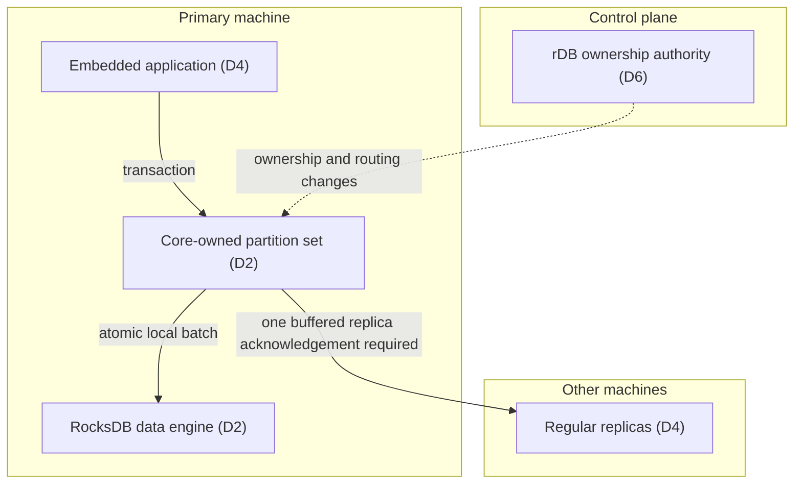

# Partition database — architecture decision brief

State: HANDOFF — selected architecture; validation pending  
Date: 2026-09-20  
ADR status: **Accepted — Gautam selected B/package on 2026-09-20**  
Scope: design documentation only; no implementation authorization.

> **Selected direction:** B — one RocksDB data engine per core-owned partition set, with logical partitions inside it. Keep rDB as the separate ownership authority.
>
> Confidence: moderate for decomposition; low for unmeasured latency/resource limits. Engine-count, recovery and compaction benchmarks can change the storage choice.
>
> Next action: review the selected specification and its pending implementation gates.

## 1. Decisive dots

- **D1 — User requirement:** production up to 50 machines; easy small-cluster setup.
- **D2 — User requirement:** logical partitions target 10–50 GB; multiple partitions form a core-owned set.
- **D3 — User requirement:** 2,000 small transactions/sec/core at normal local-deployment p99 of 1–5 ms.
- **D4 — User requirement:** atomic transactions within one partition; success waits for one secondary to buffer the complete transaction.
- **D5 — User requirement:** warn then pause on lag; after majority replica loss, recover reads and hold writes until reprotected.
- **D6 — Inspected fact:** rDB provides Raft-backed configuration CAS and watches; embedding does not bypass consensus. [E1]

Connection: D1–D5 describe a data plane with different latency and loss semantics from rDB. D6 supports configuration coordination, not a ready-made partition data plane.

**Takeaway:** data transactions use local execution and replica transport; rDB coordinates ownership outside the per-write path.

Mermaid syntax reviewed as text; target rendering not yet verified.

## 2. Measurable scenarios — defined before option ranking

Targets below are proposed acceptance criteria, not benchmark results.

| Scenario | Stimulus and environment | Response and measure |
|---|---|---|
| Q1 — normal transactions | Local-network clients; 2,000 tx/sec per active primary core; small multi-key transactions | p99 successful reply ≤5 ms over 30 minutes; measure incoming replicas and persistence work too |
| Q2 — majority loss | Three configured regular copies; arbitrary two are lost; control quorum remains | Recover a whole-transaction prefix from survivor; expose recovery generation/loss uncertainty; reads only until all three regular copies are rebuilt |
| Q3 — replication stall | A required copy stalls with outstanding transactions | Warn at 1 s unsafe age; stop admitting new transactions by 2 s plus ≤100 ms scheduler allowance; no successful ACK without a required secondary even before threshold |
| Q4 — ownership failure | Old primary partitioned/paused; replacement requested | No new ownership becomes active before prior grant is revoked/expired under validated fencing contract; no old-epoch append accepted in new lineage |
| Q5 — capacity growth | Homogeneous 3–50 node placements with 10–50 GB partitions | Separate replica-count and primary-count targets; minimize skew subject to domain/capacity limits; avoid moving entire core sets |
| Q6 — transaction crash | Crash at any storage/replication boundary | Recover all or none of each transaction; no holes in accepted lineage; retry identifies same request or reports unknown/lost-generation outcome |

Benchmark assumption for Q1: 4 keys ×1 KiB values per transaction, NVMe storage, local network, ≥70% of offered transactions are writes, dataset larger than aggregate data-engine cache. Hardware inventory and read/write mix must accompany every result.

## 3. Three viable layouts

All options use the same proposed partition protocol. They differ in storage-engine boundaries, not in whether they implement safe ownership.

| Decision driver | A — one data engine/node | B — one data engine/core set | C — one data engine/partition |
|---|---|---|---|
| Smallest change from rDB storage shape | Smallest shape change: one instance/node (inference from config store [E2]) | New per-core lifecycle | New per-partition lifecycle |
| Core-local contention isolation | Shared write/storage scheduling | Closest match to user's core-set unit | Partition isolation; core hosts many instances |
| Cache/compaction coordination | Central budgets simplest | Shared process-level budgets still required | Largest instance-budgeting surface |
| Logical partition movement | Export selected prefix | Export selected prefix | Partition-scoped directory/checkpoint possible |
| 10–50 GB partition count growth | Instance count independent of partitions | Instance count tied to cores, not partitions | Instance count grows with partitions |
| Main risk | Shared engine contention/tail coupling | Cross-partition compaction within a core set; engine overhead | Open-file, memory and background-work overhead |

All comparative resource/latency statements are **inferences**, not measurements. A remains viable if shared-engine benchmarks meet Q1 more efficiently. C becomes attractive if per-partition portability materially outweighs measured engine overhead.

## 4. Selected decision package

### Execution and storage

| Decision | Proposed default | Reason / consequence |
|---|---|---|
| Engine boundary | **B: RocksDB per core-owned set**, fixed small CF set, partition-prefixed keys | Aligns execution with sizing; avoids an engine/CF per logical partition; actual budgets need validation |
| Transaction model | Serialized partition-local transactions; one admitted transaction in flight/partition initially; concurrency across partitions | Simple ordered replay and atomic writes; hot partitions may require a later pipeline |
| Data model | Explicit affinity-group key + user key; transactions reference one group in v1 | Preserves a durable colocation contract as partitions split; narrower than arbitrary same-partition key mixing |
| Logical size | Split planning at 40 GB; aim for two ~20 GB children before ~50 GB | Operational headroom; not a hard maximum for an indivisible affinity group |
| Partition growth | Range split on hashed affinity-group space; never split a group | Online snapshot/catch-up then brief write fence; oversized groups require app reshaping |

### Replication and recovery

| Decision | Proposed default | Reason / consequence |
|---|---|---|
| Placement | Three regular copies on distinct machines; optional extra non-primary shadows | Two-copy loss can leave a readable survivor; recent suffix may be absent |
| Success | Primary + one regular secondary buffer/apply the complete atomic transaction; WAL enabled, no fsync wait | Matches selected ACK semantics; survives a single holder failure only if recovered from a holder |
| Background protection | Send to all regular copies immediately; group WAL sync target 10 ms | Reduces practical exposure; neither 10 ms nor 1–2 s is a guaranteed RPO during outages |
| Degraded policy | Required regular-replica age warn 1 s, pause 2 s; failure to get any secondary ACK blocks success immediately | Third-copy lag is not masked by healthy primary+secondary ACKs |
| Single-node failure | Fence old primary; synchronize both survivors; resume with both required for every ACK; rebuild third urgently | Preserves writes without permitting one-copy ACKs |
| Majority-loss recovery | Safe promotion to read-only; restore all three regular copies before writes resume | Deliberately trades write availability for restored protection |
| Shadows | Async, never primary, excluded from default ACK/quorum; separately balanced | Additional recovery/export copies, not a substitute for regular-copy protection |

### Ownership and placement

| Decision | Proposed default | Reason / consequence |
|---|---|---|
| Config topology | Three rDB voters separate from data membership; client/watch locally cached on other nodes | 50 database nodes do not imply 50 control voters; local embedding is not local consensus |
| Ownership | Per-partition monotonically increasing epoch plus expiring per-node grant | CAS alone is insufficient to revoke a paused primary; grant extension is new work |
| Fencing | Freeze renewal, revoke/drain or conservatively expire previous grant before activation | Automatic promotion blocked if timing/fencing preconditions cannot be proven |
| Scheduler | One active planner; CAS changes authoritative records; followers observe | Prevent competing placement plans; planner election must use same fenced-grant rules |
| Balance | Separate regular-copy, primary, and shadow counts; then bytes and measured load | Count balance is soft when bytes, capacity or failure-domain rules conflict |
| Actor boundary | Actor activation follows ownership; state + inbox/outbox dedup in one transaction | External effects require destination idempotency/fencing; no blanket exactly-once claim |

## 5. What the package explicitly does not promise

- No zero-loss guarantee after arbitrary majority loss or all-copy power loss.
- No global linearizability across a failover that loses acknowledged writes.
- No automatic primary promotion based only on a watch notification or stale cached CAS value.
- No cross-partition transactions or splitting a transaction affinity group.
- No cross-region 5 ms latency promise; local ACK copies and remote shadows are distinct roles.
- No existing rDB ownership-lease feature is assumed; it is an explicit new control contract.

## 6. Risks that can change the choice

**High — fencing:** failover correctness depends on a new lease/revocation implementation and validated timer assumptions. Without them, fail closed and require verified node fencing.

**High — retained recent suffix:** a stale sole survivor may lose acknowledged transactions. Report a new recovery generation; callers reconcile rather than interpreting a retry as exactly-once success.

**Medium — B versus A:** per-core engine budgets and compaction tail latency are not measured. Run an equal-budget A/B experiment before implementing irreversible storage layout commitments.

**Medium — affinity restriction:** v1 transaction keys must share an affinity group. The user accepted this transaction-boundary tightening with the package; application ergonomics remain to validate.

**Medium — source limitations:** PostgreSQL documentation access was policy-denied. No bypass was attempted; failure arguments are labelled protocol inferences, not externally verified guarantees.

## 7. Evidence and review

| ID | Source | Class / access / depth | Exact fit and limit |
|---|---|---|---|
| E1 | [rDB primitive packet](evidence/rdb-primitives.md), [follow-up](evidence/rdb-primitives-followup.md); pinned rDB `c3fe56bd19674967417897d9691ac44b9f98899b` | PROJECT-ARTIFACT; accessed 2026-09-20; relevant source read, no runtime execution/benchmark; individual dates where shown in packets | CAS, watch and embedding paths; no proof of partition ownership fencing |
| E2 | [Storage packet](evidence/storage-source-fit.md); Cargo.toml, rocks.rs, state.rs at pinned revision | PROJECT-ARTIFACT; accessed 2026-09-20; source read, no runtime execution/benchmark; per-file publication date none shown | Existing RocksDB declaration, one-instance shape and batch ordering; no data-plane throughput proof |
| E3 | [Fault-model packet](evidence/fault-model-inferences.md) | INFERENCE from explicit failure histories; not external empirical evidence | Alarm, replica-loss and stale-owner counterexamples; not implementation correctness |

This architecture process and ADR format are conventions, not a standards-mandated method. Helper review is not statistically independent verification; runtime tests remain necessary.

## 8. Recorded selection

Gautam explicitly selected B and the package on 2026-09-20. The comparison above records why; the [design specification](design-specification.md) is the detailed normative contract. New tuning defaults are unvalidated and do not silently change the accepted architecture.

**Outcome: READY_FOR_REVIEW — selected design, not implementation authorization.** See [developer handoff](developer-handoff.md) and [validation plan](validation-plan.md).
