# Embedded partition database — design specification

State: VALIDATE → HANDOFF  
Selected: **B — RocksDB per core-owned partition set**, approved by Gautam on 2026-09-20.  
**DRAFT — NOT AUTHORIZED FOR IMPLEMENTATION**  
Document revision: 1.6 (exact value-layer formats selected: deterministic CBOR, direct-key map/set plus order-statistic B+ tree lists, and object-scoped chunked blobs). Architecture and value-layer direction selected; runtime validation is pending.

## Read this first

**Decision:** embed the data engine, not a distributed consensus round on every local operation. rDB owns control metadata; three data replicas maintain each partition.

**Success means:** the primary and one regular secondary have buffered/applied the complete transaction. It does **not** mean fsync, all-copy persistence, or survival after arbitrary majority loss.

**Highest-risk dependency:** fenced ownership. No automatic failover is released until its clock, revocation and stale-request tests pass. A watch or CAS alone never grants safe failover.

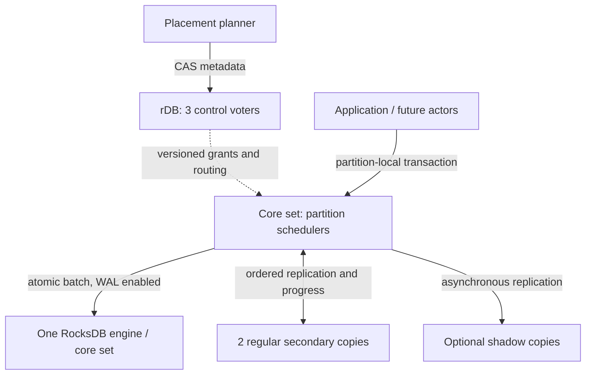

**Takeaway:** coordination, execution and replication are separate responsibilities; embedding removes a local API hop, not network replication.

Related: [decision brief](architecture-brief.md), [ADR](../ADRs/rdb/0001-core-set-partition-database.md), [developer handoff](developer-handoff.md), [validation plan](validation-plan.md).

## 1. Scope and decision ledger

### 1.1 Accepted boundaries

| ID | Decision | Basis |
|---|---|---|
| D1 | Up to 50 production machines; local deployment first; larger geography later | User requirement |
| D2 | 10–50 GB logical partitions, many per core set; one data engine per set | User sizing and selected B |
| D3 | 2,000 small transactions/sec/primary core; local p99 ≤5 ms | User target, unmeasured |
| D4 | Atomic multi-key transactions in one explicit affinity group and partition | User selected package; enables safe splitting |
| D5 | Three regular copies; primary + one regular-secondary buffered ACK | User selected package |
| D6 | After one node fails, synchronize both survivors and resume with required two-copy ACK while rebuilding; after majority loss, remain read-only until three copies return | User selections |

### 1.2 Accepted control and evolution boundaries

| ID | Decision | Basis |
|---|---|---|
| D7 | Three rDB control voters; separate data-node membership | User selected package |
| D8 | Epochs plus expiring grants and conservative fencing; fail closed without proof | User selected package; new capability required |
| D9 | Separate balancing objectives for regular copies, primaries and shadows | User requirement |
| D10 | Actor inbox/state/outbox transaction, destination idempotency/fencing required | Selected evolution boundary |
| D11 | No cross-partition transactions, no blanket exactly-once or zero-loss promise | Consequence of selected scope |
| D12 | Split by affinity-hash range; never split an affinity group | Selected package |
| D13 | Hybrid value layer: whole small values, separately stored collections, chunked large blobs | User selected on 2026-09-20 |
| D14 | Canonical logical mutations drive replication; RocksDB Merge is opt-in only for bounded, validated mutation families | User selected package; upstream research |
| D15 | Flexible documents use the selected deterministic RFC 8949 CBOR profile | User selected on 2026-09-20; encoding evidence |
| D16 | Maps/sets use direct ordered keys; lists use stable elements plus an order-statistic B+ tree | User selected on 2026-09-20 |
| D17 | Large blobs use object-scoped immutable chunks with no cross-object deduplication in v1 | User selected on 2026-09-20 |

All MUST/SHALL statements below are proposed implementation contracts under the accepted architecture. Tuning values are initial defaults to validate, not observed guarantees.

## 2. Terms and units

| Term | Meaning |
|---|---|
| Partition | Logical hash range, recovery lineage, ordered transaction history and replica placement unit |
| Affinity group | Application-selected stable ID; all atomically related keys share it; hash selects partition |
| Core set | Local scheduler owning multiple primary/secondary partitions and one data engine; not a replication unit |
| Regular replica | Primary-eligible copy on a distinct machine; counts toward default protection |
| Shadow | Never-primary asynchronous copy; does not replace a regular copy in ACK or readiness predicates |
| Control voter | rDB Raft member, independent of which partitions the machine stores |
| Recovery generation | Monotonic partition history incarnation; callers use it to detect possible rollback |

GB means decimal bytes for planning. Partition size counts live logical key/value bytes; placement also accounts for actual disk bytes, retained history and compaction space. The 50 GB value is not an enforceable cap for a single indivisible group.

## 3. Components and embedding

### 3.1 Who decides, owns and serves

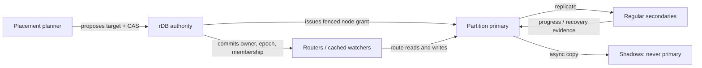

**Takeaway:** the planner proposes; rDB makes the authoritative decision; only the granted primary serves operations.

### 3.2 Runtime boundaries


| Component | Responsibility | Logical owner for future implementation |
|---|---|---|
| Embedded API/router | Routing cache, deadlines, retry identity, affinity checking | API module owner |
| Core-set executor | Partition serial queues; shard-local state; bounded IO dispatch | Runtime module owner |
| Storage adapter | Atomic batches, logical history, checkpoints, prefix export/import | Storage module owner |
| Replication/recovery | Ordered append, watermarks, catch-up, lineage validation | Replication module owner |
| Control adapter | rDB metadata, grants, watches, coherent resync | Control module owner |
| Placement/lifecycle | Planner, balancing, copy changes, split/move orchestration | Placement module owner |
| Actor adapter, later | Activation gate, inbox/outbox, external-effect boundary | Actor module owner |

These are component roles, not invented staffing assignments. Implementation approval must bind people to the roles.

The process embeds the database API. A control voter may also embed rDB DirectClient; other data nodes use a cached control client/watch, not a hidden full-voter-per-node topology. Loss of the control quorum eventually stops lease-backed writes even if data replicas still communicate.

For v1 validation, exactly one core set maps to each configured primary execution core (a reserved logical CPU); SMT topology must be reported. Throughput is normalized by those configured cores, never by total machine cores or a dynamically increased set count. Set count and core count are equal in the benchmark fixture; changing that invariant requires new validation.

RocksDB calls are blocking. Submit them to bounded IO workers; do not block the core executor while waiting on network or fsync. CPU pinning applies to execution ownership; background compaction and IO thread budgets are explicitly process-wide.

## 4. Storage layout and resource budget

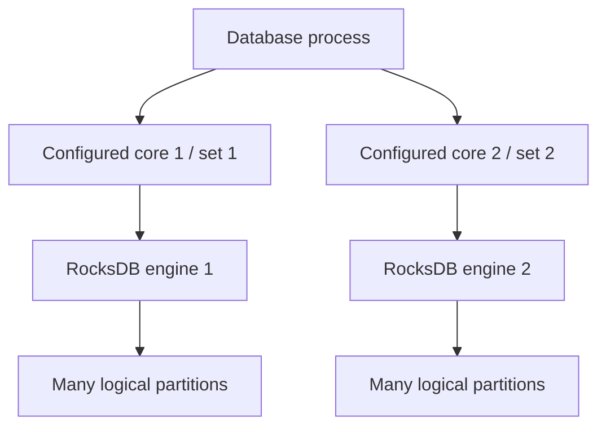

**Takeaway:** one configured primary core owns one set and one engine; partitions remain independent placement and recovery units.


### 4.1 One engine per core set

Use a fixed set of column families: `data`, `history`, `metadata`, `dedup`, `actor`. Prefix every key with an unambiguous length-delimited partition ID and generation; encode group and user keys deterministically.

One transaction WriteBatch contains its deterministic mutation list/history envelope, all user-key changes, request-result dedup entry and last-applied metadata. WAL is enabled; `sync=false` on the fast path. Never reproduce rDB's whole state-machine or consensus log as the data API.

A logical history record is retained in RocksDB as data; native engine WAL sequence numbers are not the cross-node replication identity. Core engines may mix many partitions in the physical WAL; each partition still has its own logical ordered history.

### 4.2 Initial bounded budgets

| Resource | Initial rule | Failure behavior |
|---|---|---|
| Data-engine memory | Shared cache budget ≤25% node RAM; shared memtable budget ≤15%; tune within a total ≤60% DB-process RAM envelope | Backpressure before host OOM; include native allocations in measurement |
| Local queues | Max 1,024 waiting requests/partition and 64 MiB/core set, whichever trips first | `OVERLOADED`, before admission |
| Transaction envelope | Max 256 mutations and 1 MiB encoded bytes; fixed v1 defaults | `INVALID_ARGUMENT` before mutation |
| Core-set count | One per configured primary execution core, not every logical hardware thread by default | Record actual map in benchmark/configuration |
| Disk headroom | Stop new placements at 70% allocated capacity; warning at 80%; stop new writes at 90% | Preserve room for compaction/recovery; alert before rejection |
| Background moves | At most one inbound and one outbound bulk transfer/node; initial cap 10% measured disk/network sustainable bandwidth | Foreground budget wins; pause transfers on p99 breach |

Budgets are tuning defaults. A target failing within these limits requires measured revision, not hidden resource expansion.

### 4.3 Selected hybrid value layer

The public value model supports four logical families:

| Family | Logical contract | Initial physical form |
|---|---|---|
| Binary | Opaque application bytes | Whole encoded value when inline; manifest plus immutable chunks when large |
| Document | Flexible extended-JSON types: null, boolean, signed/unsigned integer, float, decimal, string, binary, timestamp, array and object | Canonical binary document for bounded objects |
| Typed actor state | Application schema ID and schema version plus encoded payload | Whole object or application-declared subobjects |
| Collection | Map, set or ordered list inside one actor/affinity namespace | Metadata plus independently addressed elements or bounded pages |

Every stored object has `object_id`, `kind`, `format_version`, `object_version`, logical length and integrity digest. Every mutation supplies `expected_object_version` or an explicit create-if-absent condition. Unknown mandatory formats fail before mutation; decoders for retained old formats remain available through migration and snapshot retention.

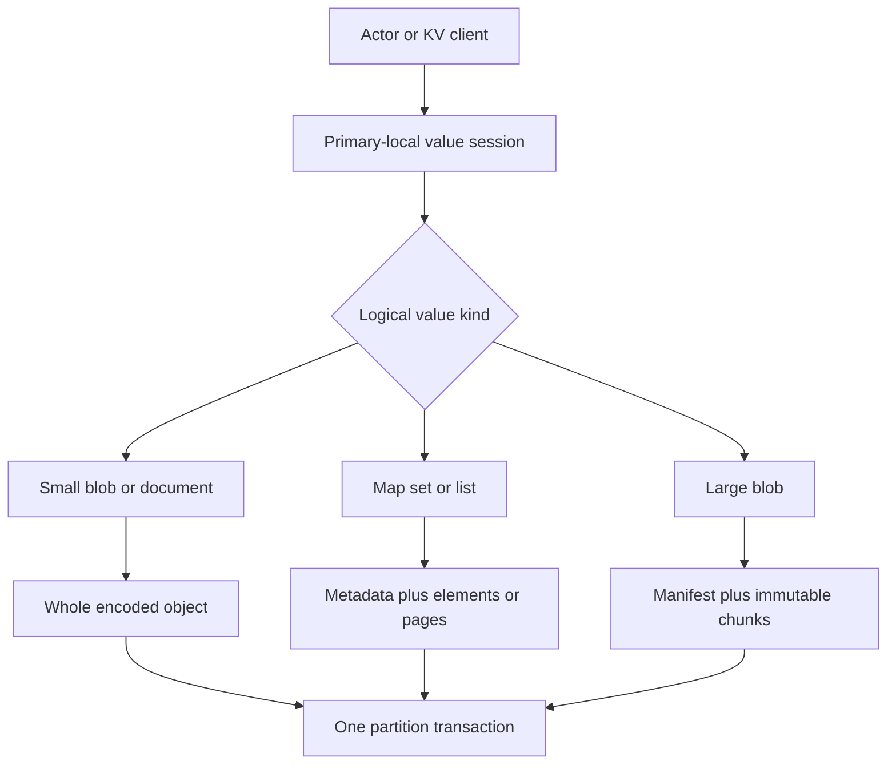

**Takeaway:** callers see one versioned value API; storage shape changes by value kind so small values stay simple and large collections avoid whole-value rewrites.

#### 4.3.1 Size classes and large blobs

Initial validation defaults are: preferred whole-document size at most 256 KiB, hard inline encoded value limit 1 MiB, blob chunk size 1 MiB, and maximum logical blob 256 MiB. These are not measured guarantees. The existing 1 MiB transaction-envelope limit still applies.

A large-blob upload therefore uses idempotent immutable chunk writes followed by one atomic manifest publication. Chunks are scoped to one blob object and upload/generation; v1 never shares them across objects or generations. Every chunk has a BLAKE3-256 plaintext digest for integrity, plus stored-payload checksum and optional compression/encryption metadata. A manifest names the exact ordered indexes, lengths and digests, total length, whole-blob digest, codec and object version. Readers validate manifest and chunk digests. Aborted or replaced generations remain unreachable and are garbage-collected only after snapshot, read-session, replication, backup and rollback retention gates.

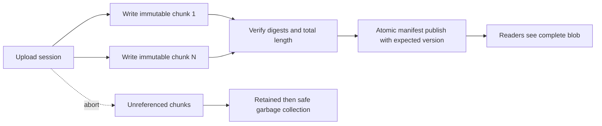

**Takeaway:** incomplete uploads are invisible; one small atomic manifest switch publishes the complete large blob.

Chunk upload uses a retry-stable `upload_id` over a separate authenticated, flow-controlled stream; chunk frames are at most 256 KiB and do not consume the transaction envelope. Rewriting one index with identical bytes succeeds; different bytes return `UPLOAD_CHUNK_CONFLICT`. Completion requires contiguous indexes and verified lengths/digests. Before manifest admission, the primary must prepare and verify all required chunks on one selected regular secondary within 5 s. Failure returns definitive `BLOB_DEPENDENCY_UNAVAILABLE` before local apply. A prepared-secondary token binds that chunk set to the manifest digest; only that secondary's matching transaction ACK counts. Publication then uses a normal transaction with `expected_object_version`; version conflict leaves the upload unreachable. Range reads resolve one manifest and fetch only intersecting chunks. Exact records, recovery and safe-floor GC are defined in [the blob layout decision](evidence/blob-layout-decision.md).

#### 4.3.2 Documents and collections

V1 document mutations are key-path operations evaluated on the primary: get/set/remove field, numeric increment with declared overflow behavior, and compare-by-object-version. Arbitrary stored procedures, user callbacks and secondary-side business logic are forbidden. A document mutation either writes the new canonical whole document or uses a later validated optimization without changing the logical transaction record.

Flexible documents use `codec_id=rdb-cbor-document`, `codec_version=1`, and an rDB deterministic CBOR profile based on RFC 8949: definite lengths; UTF-8 text map keys; no duplicates; deterministic encoded-key ordering; shortest integers/lengths; finite binary64 with negative zero preserved; native byte strings; normalized decimal-fraction tag 4; registered extended-time tag 1001 with exactly epoch seconds plus optional nanoseconds; and rejection of every other tag or `undefined`. Always encoding floats as binary64 is an explicit profile deviation from RFC 8949's preferred shortest-float rule. The envelope stores codec/version, object version, logical/encoded length, digest algorithm, digest and canonical bytes. Resource limits are checked before commit. Unknown mandatory codec versions fail closed. Exact rules and evidence are in [the encoding decision](evidence/document-encoding-decision.md).

Maps and sets use one direct ordered record per canonical key/member. Their v1 key profile permits null, boolean, signed/unsigned integer, finite `f64`, UTF-8 string, byte string, timestamp and decimal; arrays, maps and application tags are rejected as keys. Ordering is type-first then value. Numeric types are distinct domains with no cross-type normalization. The versioned memcomparable encoding makes RocksDB byte order the public database order; exact discriminator and within-type rules are in the collection decision.

Lists use stable 128-bit element records plus an order-statistic B+ tree. Internal nodes record each child's element count and encoded byte total. Leaf nodes keep ordered element IDs. Positional lookup and mutation are `O(log n)` and rewrite one bounded root-to-leaf path. Initial validation targets are 16 KiB nodes, split above 24 KiB, redistribution/merge consideration below 8 KiB and maximum height 8. These are stored-format-versioned tuning limits, not silent invariants. Exact records and scan tokens are defined in [the collection layout decision](evidence/collection-layout-decision.md).

A collection is one logical versioned object. Every collection mutation MUST condition on its current collection `object_version`; each successful logical mutation increments that version exactly once, even if several elements/pages change. Element and page records carry internal storage revisions for corruption checks and deterministic replay, but those revisions are not independent public concurrency tokens in v1. Callers may additionally require target-element presence, absence, value digest or stable element ID. Deletes write a tombstone carrying the mutation sequence until dedup, snapshot and recovery retention permit removal. Results return the new collection version and, for list insertions, the assigned stable element ID. Therefore two concurrent mutations from the same old collection version conflict even when they touch different elements; finer-grained concurrency is deliberately deferred.

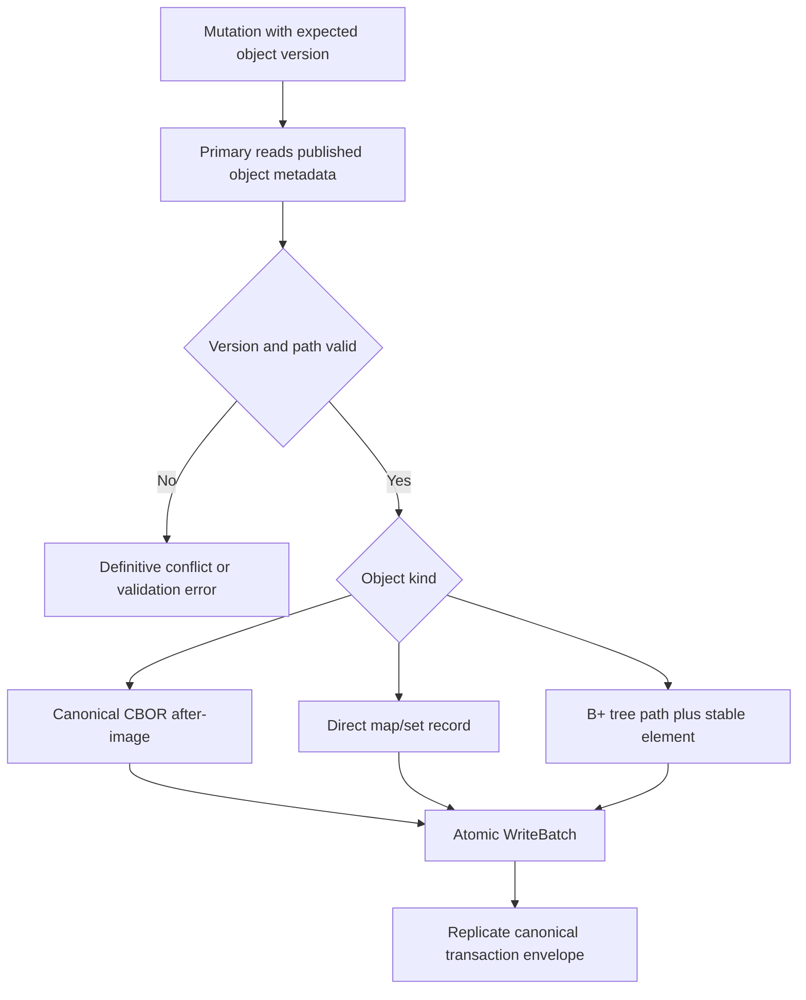

**Takeaway:** primary-local computation is allowed, but the committed result is bounded, deterministic, version-checked and atomically replayable.

#### 4.3.3 Actor-local object namespace

One actor affinity group may contain multiple independently versioned objects: root state, named maps, sets, lists, blobs, inbox, outbox and timers. They share the partition transaction boundary but not one giant serialized value. Object IDs and collection element keys remain within the same tenant and affinity prefix, so partition movement and splitting cannot separate them.

The actor runtime opens a primary-local session at one published partition prefix. It reads objects, computes changes in process, and commits one transaction containing all expected versions and mutations. No session survives authority loss, generation change, deadline expiry or actor deactivation.

#### 4.3.4 RocksDB Merge boundary

RocksDB Merge is a local physical optimization, never the replication or recovery protocol. Replicas receive the canonical logical transaction and deterministically produce the same object versions and after-images. A mutation family may use Merge only after all of these gates pass:

- exact reference materializer and deterministic ordered replay;
- property-tested partial-merge equivalence, when partial merging is enabled;
- bounded operand count, bytes, read latency and compaction memory;
- panic/exception containment and corrupt-operand quarantine;
- compatible old operand decoders across reopen, rolling upgrade, snapshot and restore;
- measured benefit over whole Put or split-object storage.

Initial candidates are counters, min/max and append of immutable-ID entries. Generic JSON path updates do not use Merge by default. The detailed upstream evidence and Rust binding limits are in [the Merge analysis](evidence/rocksdb-merge-analysis.md).

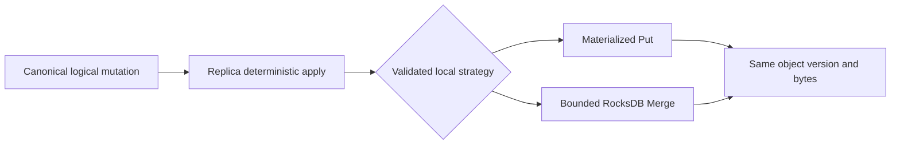

**Takeaway:** Merge may change local write cost, but it may not change the database’s visible value, version, replication or recovery semantics.

## 5. API and transaction semantics

### 5.1 Request contract

`TxnRequest` required fields: `api_version=1`, `tenant`, `affinity_id`, `client_id`, `request_id`, `expected_generation`, `deadline`, `conditions[]`, `mutations[]`. Conditions compare key/object versions or absence. Mutations include whole put/delete, document path operations, collection element/page operations and blob-manifest publication; every object mutation names its expected object version. Remote deadlines are transmitted as remaining duration, not trusted client wall-clock timestamps.

Keys MUST share tenant and affinity ID. Arbitrary user callbacks and externally held transactions are not accepted in v1. Reads/conditions and mutation construction run serially against the partition's authoritative local state.

`TxnResult` returns `partition_id`, `owner_epoch`, `generation`, `seq`, `outcome`, and `durability=BUFFERED_ON_TWO`. Result order is the partition order, not a global ordering across partitions.

### 5.2 Ordered write path

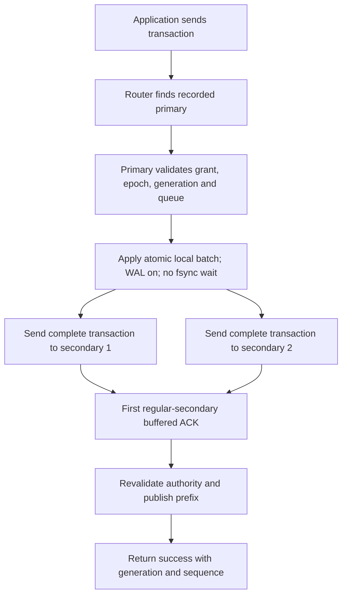

**Takeaway:** success needs one regular-secondary acknowledgement; the other copy continues concurrently and disk sync remains asynchronous.


1. Resolve affinity hash; validate route, owner grant, epoch, generation, limits and health admission.
2. Serialize at partition queue. Resolve dedup; check conditions; assign next sequence and deterministic after-images.
3. Revalidate grant/epoch at storage dispatch; cancel expired work. Apply one atomic local batch with WAL enabled in that generation’s namespace; no fsync wait. Local storage failure fences the partition.
4. Replicate the identical transaction envelope to both regular secondaries concurrently; shadows receive separately.
5. A secondary validates contiguous ancestry and epoch, applies its atomic batch, then returns `buffered_applied_seq`.
6. Recheck authority and generation; return success only after one regular-secondary ACK. Advance client-visible successful prefix before serving the next queued operation.
7. Group sync asynchronously; update verified durable watermarks only after a successful flush boundary.

Initially allow one admitted transaction in flight per partition. Other partitions in the set keep running. A single hot partition cannot be assumed to achieve 2,000 tx/sec with network waits; the normative target is per configured primary execution core.

### 5.3 Timeouts, visibility and dedup

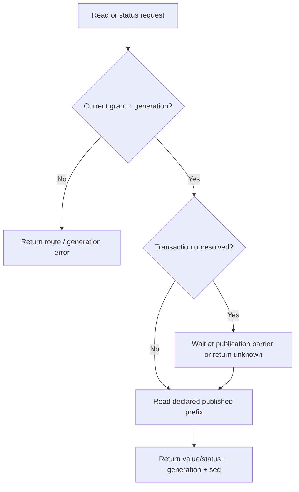

**Takeaway:** reads never expose raw locally applied bytes; every consumer sees only the declared published prefix.


After local application, timeouts or lease loss return `UNKNOWN_OUTCOME`, never definitive failure. Freeze that partition's normal read/write queue until the transaction is resolved with a replica ACK or an explicit recovery decision. No later transaction may skip the unresolved sequence.

Publication is a distinct local state transition serialized by the partition executor. Only the required ACK plus an authority recheck may publish the applied prefix; a lost client reply does not reverse publication.

All API reads, snapshot/export workers, actor readers, timers and outbox dispatchers acquire a partition publication barrier. They never read the raw prefix.

The barrier waits for the in-flight transaction or obtains an immutable snapshot at the previous published prefix. Maintenance cannot export partially published state; isolated diagnostic/recovery readers cannot produce application effects.

Within one active generation, primary reads pass the same authority gate and serial queue; they see an ordered whole-transaction prefix. Healthy secondary reads are not exposed in v1. After recovery, reads declare the new generation and may observe loss of previously acknowledged values.

Dedup key is `(tenant, client_id, request_id)` scoped to its affinity group and generation; store request digest and result atomically. Same identity with changed payload is `REQUEST_ID_REUSE`. Keep dedup entries at least 24 hours; beyond retention callers cannot infer nonexecution from absence.

A retry with stale expected generation returns `GENERATION_CHANGED` before any mutation. The caller must reconcile on recovery; it must not silently retry a lost-generation transaction as a new effect. A transaction received by a replica may recover even if its client never saw success.

### 5.4 Error categories

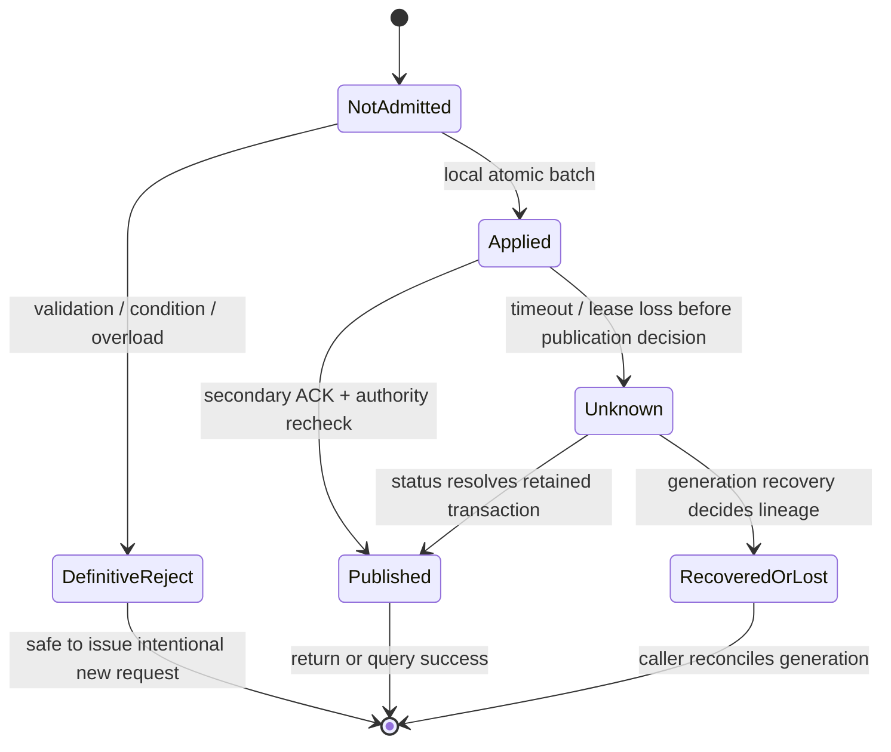

**Takeaway:** only pre-admission rejection proves no mutation; post-apply failure is an unknown outcome resolved by status or recovery.


| Error | Retry rule |
|---|---|
| `NOT_PRIMARY`, `ROUTE_CHANGED` | Refresh route; retain request identity and expected generation |
| `LEASE_EXPIRED`, `RECOVERY_READ_ONLY`, `PROTECTION_PAUSED` | Retry after health/authority recovers; do not assume already-admitted request failed |
| `CONDITION_FAILED`, `CROSS_AFFINITY`, `INVALID_ARGUMENT` | Definitive rejection before mutation; caller changes request intentionally |
| `OVERLOADED`, `DEADLINE_BEFORE_ADMISSION` | Definitive no-admission; bounded jittered retry |
| `UNKNOWN_OUTCOME` | Query status with same identity; do not generate a new request ID |
| `GENERATION_CHANGED`, `REQUEST_ID_REUSE`, `UPLOAD_CHUNK_CONFLICT` | Reconcile or fail; never transparent replay; chunk conflict means the upload/index identity was reused with different bytes |
| `BLOB_DEPENDENCY_UNAVAILABLE` | Definitive pre-admission rejection; resume/repair chunk preparation and retry the same publication identity |
| `STALE_CONTINUATION` | Restart the scan at a new snapshot/version; never silently continue against changed ordering |
| `CORRUPT_BLOB`, `CORRUPT_HISTORY`, `INCOMPATIBLE_VERSION`, `STATUS_EXPIRED` | Quarantine/reject; operator or rollout action; corrupt blob streams yield no successful partial result |

## 6. Replication and durability

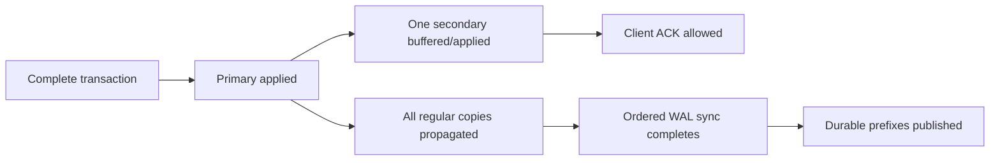

**Takeaway:** buffered success, all-copy propagation and disk durability are different milestones and different metrics.


### 6.1 Envelope and acknowledgement

Envelope fields: `protocol_version`, `partition_id`, `generation`, `config_version`, `owner_epoch`, `lease_id`, `seq`, `prev_digest`, `request_identity`, `request_digest`, `conditions_result`, `mutations`, `result`, `record_digest`. Sender authentication binds node identity; unauthenticated append is rejected.

The secondary checks epoch/config membership, previous digest, exact sequence and size before mutation. Same sequence/same digest is idempotent; same sequence/different digest quarantines the stream. Gaps return `NEED_PREFIX`, never speculative out-of-order apply.

Track per replica: `received_seq` (diagnostic), `buffered_applied_seq` (complete engine batch), and `durable_seq` (confirmed fsync prefix). All are partition/lineage qualified; only complete contiguous transaction boundaries advance.

The storage adapter exposes `sync_wal_through(captured_prefixes)`. It holds a per-engine write-order mutex from capture through `DB::flush_wal(true)`, after all captured WriteBatch calls return. No concurrent engine write may bypass it.

Disable manual WAL flushing and optional concurrent or pipelined writes unless this ordering is requalified. The adapter must prove that the chosen native version fsyncs every captured complete transaction; a memtable flush is not a substitute.

Only unambiguous success publishes the captured prefixes. Error or partial completion advances nothing. This contract requires validation; source inspection has not established it.

### 6.2 Timing and pause policy

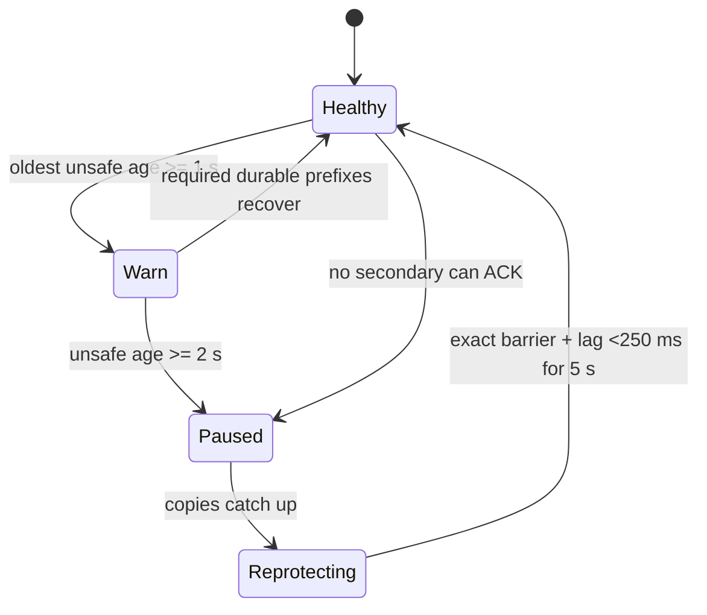

**Takeaway:** lack of an ACK secondary blocks success immediately; the two-second threshold governs broader protection lag, not local-only writes.


| Setting | Initial default | Contract |
|---|---|---|
| Group WAL sync | 10 ms scheduling target | No guaranteed maximum; record completed sync latency and durable age |
| All-regular-copy propagation | p99 ≤20 ms healthy local target | Measured from local apply to minimum regular `buffered_applied_seq`; not guaranteed RPO |
| Unsafe-age warning | 1,000 ms | Age of oldest applied transaction not durably present on required regular copies |
| Unsafe-age pause | 2,000 ms | Reject new admission within additional 100 ms under tested scheduler budget |
| Health evaluation | Every 50 ms plus progress events | Idle partitions with no outstanding transactions do not become falsely unsafe |
| Resume | All configured regular copies durable through paused prefix; lag below 250 ms for 5 s | No timer reset merely because a replica was renamed/replaced |

Required copies are pinned by configuration version. Membership changes cannot erase old exposure: use a durable transition barrier and lineage checkpoint, then explicitly retire the old predicate. Export age and outstanding bytes separately.

If no regular secondary can ACK, success stops immediately. The 2 s threshold is not permission to ACK locally for 2 s. Pausing does not retroactively protect old ACKs; after a long outage their age-at-loss can greatly exceed 2 s.

### 6.3 Copy-loss contract

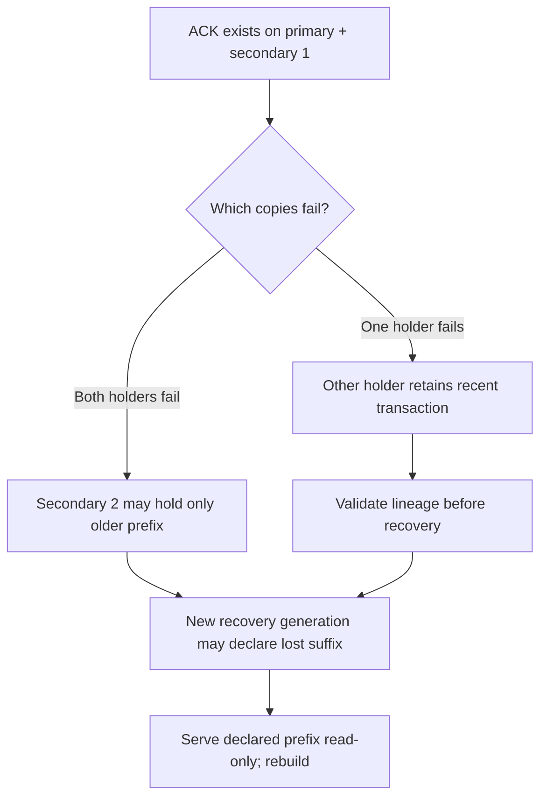

**Takeaway:** a buffered two-copy ACK protects common single-copy failures, not arbitrary loss of the exact two holders.


With three copies, primary+one buffered ACK does not ensure the third has the transaction. Losing both initial holders can lose the recent suffix; returning a whole earlier prefix is allowed only through explicit recovery generation change.

Common-power-loss and fsync/device correctness are separate failure models. Optional shadows may offer a validated recovery source but never acquire primary role; copy their history into regular membership through the same recovery checks.

## 7. Control metadata and authority

### 7.1 Authoritative records

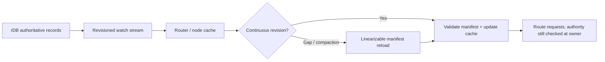

**Takeaway:** watches refresh routing caches; a gap forces coherent reload, and cached routing never grants write authority.


| Key family | Required content |
|---|---|
| `cluster/schema` | Cluster UUID, protocol/schema versions, minimum compatible data version |
| `nodes/{id}` | Boot UUID, role, failure domain, capacity, cores, drain state |
| `grants/{node}` | Grant ID, authority generation, allowed boot UUID, expiry, renewal version, mode |
| `partitions/{id}` | Range, group-hash version, owner, owner epoch, generation, membership/config version, lineage root, lifecycle state |
| `routes/{range}` | Versioned route root/manifest pointer; authoritative atomic cutover key |
| `operations/{id}` | Idempotent operation type, expected versions, phase, checkpoints and outcomes |
| `planner/grant` | Active planner authority and renewal version |

High-frequency replica watermarks/heartbeats are data-plane telemetry, not rDB writes per transaction. Control records change on authority, membership or lifecycle transitions.

Use single-record revision CAS for authority transitions. Never assume a multi-key rDB transaction: staged records become active via one CAS manifest/root pointer. Readers validate referenced versions before activation; incomplete staged data is inert.

Watch events invalidate caches; they do not grant authority. On gaps/compaction, reload a coherent manifest and resume from its recorded revision. Validate parent/root version before accepting a partially fetched view.

### 7.2 New lease contract — release-blocking

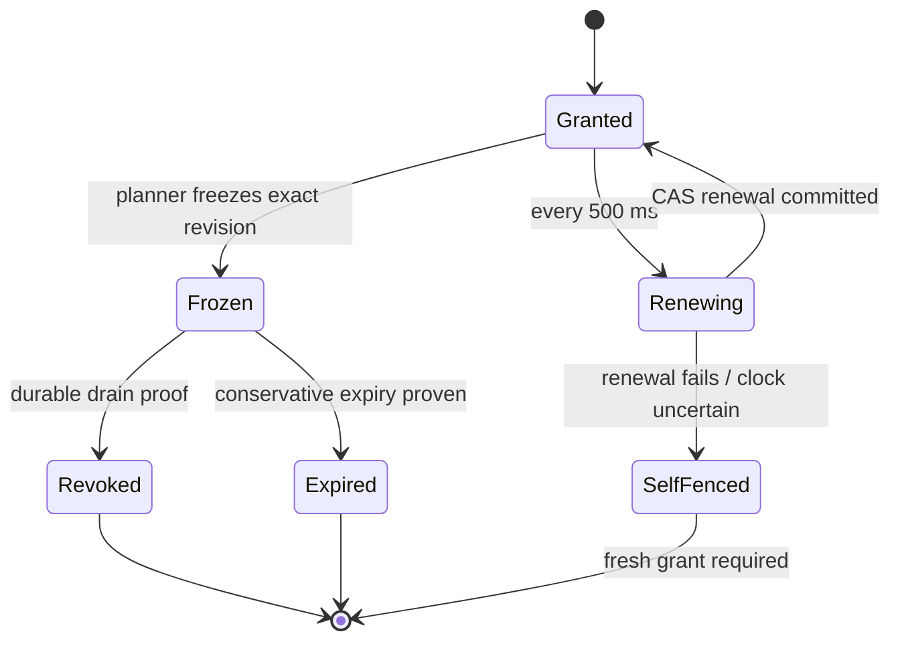

**Takeaway:** a node keeps rights only through successful revision-checked renewal; uncertainty, freeze or expiry removes admission rights.


The selected design requires new fenced-grant semantics; inspected rDB surfaces do not establish an existing implementation. A grant service uses rDB consensus to serialize grant/renew/revoke state; it is not a separate authority outside rDB.

Default grant duration is 3 s, renewed every 500 ms. Grant expiry `E` is persisted in control metadata, qualified by cluster authority generation and node boot UUID. Renewal is CAS against the unfrozen grant revision; delayed renewals after freeze/revocation cannot resurrect it.

**Bounded-clock mode:** configure verified maximum UTC error `ε=100 ms` and dispatch margin `δ=100 ms`. Old owner admission requires its clock `C_old < E−ε−δ`; new activation requires authority clock `C_auth > E+ε+δ` after a linearizable read of the final frozen expiry.

Under the stated clock-error assumption, old admission precedes true time `E−δ`. New activation follows true time `E+δ`. A process can still pause between its last check and a physical mutation.

Revalidate at IO dispatch and isolate physical effects in an epoch/generation namespace. A late old-epoch write may remain as quarantined bytes, but it cannot be published, acknowledged, exported, replicated into the active lineage or dispatched as an effect.

Revalidate at publication and reply. New-epoch activation first drains/cancels old jobs or builds a separate namespace. Safety means one accepted lineage; it does not mean an expired process can never write bytes.

Clock uncertainty beyond the configured bound, backward jumps, process resume, reboot or authority-generation change invalidates cached grants. Such nodes stop accepting requests and acquire a fresh grant; automatic promotion is disabled when error bounds cannot be established. Verified external machine fencing is the fallback, not an assumption that an unreachable machine is dead.

### 7.3 Ownership transition protocol

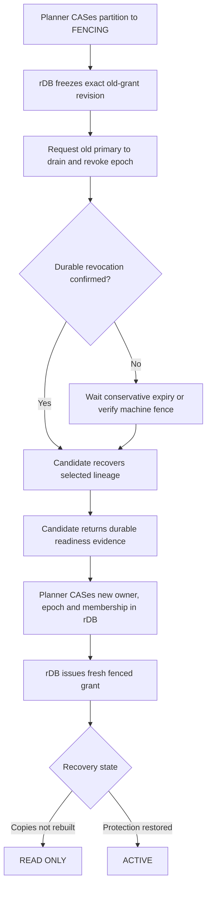

**Takeaway:** reachability does not elect a primary; rDB activates one only after the previous authority is safely revoked or expired.


1. CAS partition state to `FENCING`; freeze old-node grant renewal using its exact revision. Serialize renew/freeze races in rDB.
2. Ask the old owner to drain, stop queues and persist an irrevocable partition-epoch revocation. An ACK counts only if restart cannot restore that epoch.
3. If no verified drain/revocation, await final grant expiry under the clock contract or verified external fencing. Expiring a node grant may temporarily fence its other partitions too.
4. Issue a renewed grant excluding the revoked partition epoch to a cooperative old owner; install new membership/generation and owner epoch in one authoritative partition record.
5. Recover and durably establish the selected lineage before `READ_ONLY` or `ACTIVE`; receivers reject stale epochs, including already queued network packets.
6. Check authority at entry, storage dispatch, publication, reply and outbox dispatch. Baseline destination dedup prevents duplicate IDs only; authority-safe workflows additionally require destination epoch/version fencing or explicit reconciliation. No unqualified exactly-once guarantee.

Control-quorum loss prohibits new grants and promotions. Existing grant-backed service lasts only until conservative local expiry. Disaster recovery of the control cluster must change authority generation and fence old grants; it is a separately gated operation.

## 8. Recovery and divergent history

### 8.1 Lineage rules

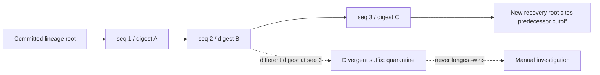

**Takeaway:** authority follows the committed root and digest ancestry, never whichever replica happens to have the longest sequence.


A lineage root in rDB contains `(partition, generation, owner_epoch, base_seq, base_digest, predecessor_generation, predecessor_cutoff)`. Every child history must descend from that root; sequence length alone never selects authority.

Within the same prior authoritative epoch, no new owner has yet written, so compatible contiguous histories can be compared by hash ancestry. Select the longest validated prefix available from eligible survivors; buffered complete entries from a live survivor may be retained, but must be fsynced before the recovery barrier is committed.

After fencing, query every reachable eligible previous regular member and verified shadow within a 2 s discovery window. Extend the window while an advertised higher compatible prefix is transferring. If that source fails, record it as unavailable before choosing a shorter prefix.

Records cannot show whether the client received its reply. Select using validated ancestry, not inferred client ACK status.

An isolated holder may remain unavailable, so D6 permits loss-accepting recovery from the surviving prefix. Record queried sources, selected cutoff and loss uncertainty.

A status query may report `RECOVERED_APPLIED` for a retained request digest/result, never claim the client received the original reply. Old-generation identities remain queryable for the 24 h dedup window through the retained lineage mapping; absence after recovery or expiry returns `UNKNOWN_OUTCOME`/`STATUS_EXPIRED`, not proof of nonexecution. Mutating retries still require explicit generation reconciliation.

Different digests at the same lineage position are corruption or a fencing violation, not a normal tie. Quarantine and block automatic promotion. A returning old owner never overrides a newer committed root, even with a longer suffix.

### 8.2 Why different secondary tails still form one history

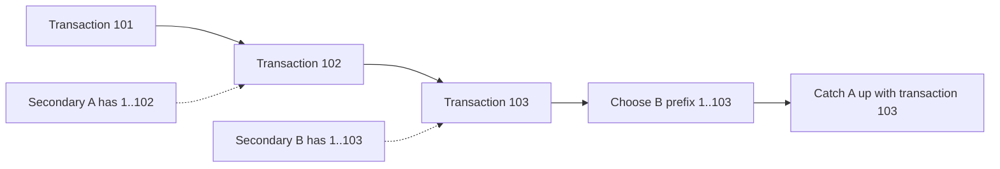

**Takeaway:** B cannot accept transaction 103 without 102; replicas differ only by suffix length, so recovery copies the missing suffix rather than merging unrelated changes.

The primary assigns one sequence at a time for a partition. A secondary accepts sequence `n` only when it has sequence `n−1` with the exact expected digest.

Suppose transaction 102 was acknowledged by A. Transaction 103 was later acknowledged by B. Before B can acknowledge 103, it must already contain 102; therefore B contains both transactions.

A and B may end at different sequences, but their shared sequence numbers must have identical digests. Recovery selects the longest compatible prefix and transfers its missing suffix to the shorter survivor. It never combines independent key changes or resolves them by timestamps.

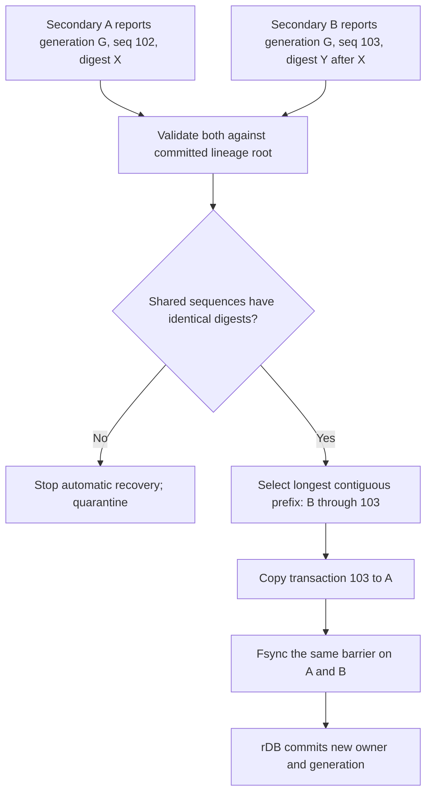

**Takeaway:** sequence plus hash ancestry decides the history; rDB records who may lead only after both survivors hold the selected barrier.

### 8.3 Single-node failure: resume with two synchronized copies

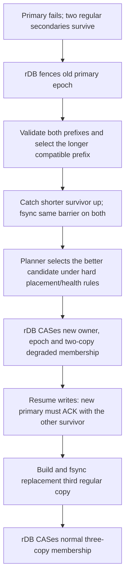

**Takeaway:** one failed node need not cause a long write outage, but writes resume only after the two survivors agree and every new write reaches both.

The longest-prefix survivor is normally preferred as new primary because it avoids reverse catch-up. It does not win merely by being longest: it must also be primary-eligible, healthy, within capacity, and hold a valid new grant. If it cannot lead, first copy its selected prefix to the eligible survivor, then grant that survivor ownership.

While running with two copies, both are required for every successful transaction. There is no one-copy fallback or two-second local-only allowance. Loss or unavailability of either copy immediately stops admission and enters majority-loss recovery.

The planner creates a third regular copy urgently under normal failure-domain and resource constraints. Promotion and new writes do not wait for that bulk rebuild, but the partition reports `DEGRADED_RF2` until the replacement is caught up, fsynced and committed into membership.

### 8.4 Majority-loss read-only recovery

```mermaid
flowchart TD
  F["Fence old owner"] --> Q["Query every reachable eligible history"]
  Q --> V{"Same lineage and digest ancestry?"}
  V -->|"Conflict"| X["Quarantine; manual recovery"]
  V -->|"Compatible"| S["Select longest validated whole-txn prefix"]
  S --> R["Commit new recovery generation in rDB"]
  R --> RO["Serve reads only from declared prefix"]
  RO --> B["Rebuild and fsync three regular copies"]
  B --> A["CAS ACTIVE; resume writes"]
```

**Takeaway:** with only one surviving regular copy, reads resume from its declared prefix; writes wait for three validated durable copies.


1. Fence old authority and determine the current authoritative lineage from rDB.
2. Freeze survivor apply; validate history checksums and complete transaction boundaries; capture the readable prefix.
3. Flush the survivor prefix durably. Persist a CAS recovery root with a new generation/epoch and declared cutoff.
4. Open reads on that exact prefix with `recovery_mode=true`; reject mutations and actor activation.
5. Rebuild regular copies from this root. Require all three to fsync the same prefix and validate checksums.
6. CAS to `ACTIVE`; resume writes after health hysteresis and fresh grants. Explicit client generation refresh is required.

Returning replicas with stale suffixes are quarantined read-only for diagnostics, then rebuilt from the authoritative snapshot. Do not delete a suffix and assume already-applied user values roll back: replace the affected partition prefix in a staging namespace and switch its local manifest atomically.

Quarantined suffix retention defaults to seven days and capacity permits; deletion requires operational policy approval. It is not merged automatically into current data. Proven corruption may require manual restore and is outside automatic majority-loss recovery.

## 9. Placement, balancing and shadows

### 9.1 Hard constraints before balancing

```mermaid
flowchart TB
  P["Partition P"] --> R1["Primary-eligible regular copy / machine A"]
  P --> R2["Regular copy / machine B"]
  P --> R3["Regular copy / machine C"]
  P -.-> H1["Optional shadow / machine D"]
  R1 --> D["Distinct machine + failure-domain checks"]
  R2 --> D
  R3 --> D
  H1 --> X["Never primary; outside ACK readiness"]
```

**Takeaway:** each partition has three independently placed primary-eligible regular copies; shadows are extra and cannot win ownership.


- Three regular copies on distinct machines; a regular primary must be on a primary-eligible node.
- Shadows never primary; enforce separately from planner preference.
- Failure-domain spread when enough configured domains exist; reject unattainable strict constraints rather than silently downgrade.
- Do not place replicas on draining/unhealthy/full nodes or two copies on one machine.
- Respect core, memory, disk and network budgets, including incoming secondary work.
- Never move the last usable authoritative copy or delete source before target validation.

### 9.2 Deterministic planning

```mermaid
flowchart TD
  I["Node capacity, roles, domains, health"] --> H["Apply hard placement constraints"]
  H --> C["Rank candidates by weighted rendezvous"]
  C --> R["Repair copy-count imbalance"]
  R --> P["Repair primary-count imbalance"]
  P --> L["Adjust bytes + measured load"]
  L --> M{"Improvement clears movement threshold?"}
  M -->|"Yes"| O["Create one versioned move operation"]
  M -->|"No"| K["Keep placement; record residual skew"]
```

**Takeaway:** constraints win first; replica counts, primary counts, bytes and load are balanced in that order by one fenced planner.


Use weighted rendezvous ranking for candidate stability, followed by constrained repair. Weights represent provisioned capacity, not momentary free space. A single granted planner proposes incremental moves; every transition uses version-checked CAS and is idempotent.

Minimize lexicographically: constraint violations (must be zero), normalized regular-copy count skew, normalized primary-count skew, byte/load imbalance, then movement cost. Shadow placement has its own count/capacity objective across shadow-eligible nodes.

For homogeneous feasible placements, target count skew `max−min≤1` for copies and primaries separately. This is a target, not an unconditional guarantee with exclusions; the planner must emit a reason and best feasible residual skew when it cannot meet it.

Bytes/CPU override count perfection when a node exceeds 120% of mean normalized bytes or 80% sustained measured CPU for 60 s. Require a ≥10% improvement in the violated metric, observe a 60 s cooldown and honor movement budgets. Record why a count-balanced placement was intentionally relaxed.

No dedicated shadow pool is mandatory. In v1, a shadow-eligible node is configured as never-primary; role changes require drain and explicit configuration approval. Shadow lag does not pause regular writes by default; expose a distinct protection alert.

## 10. Catch-up, movement and partition growth

### 10.1 Snapshot/catch-up

```mermaid
sequenceDiagram
  participant S as Authoritative source
  participant DB as Logical history retention
  participant T as Invisible target staging
  S->>S: Capture partition barrier + snapshot
  S->>T: Manifest + hashed chunks
  S->>DB: Retain history after barrier
  T->>T: Verify chunks and import staging prefix
  DB->>T: Replay contiguous transactions
  T->>T: Fsync exact seq + digest
  T-->>S: Ready(barrier, seq, digest)
```

**Takeaway:** snapshot bytes are insufficient alone; the target stays invisible until verified catch-up reaches an exact durable lineage barrier.


Take a partition-consistent snapshot at `(generation, seq, digest)`. Export only that partition prefix with a manifest of chunk hashes, sizes, format version and root digest; no assumption that a whole core-engine checkpoint is a per-partition transfer.

Retain logical history from snapshot sequence until target catches up. Set a 30-minute/20-GB retained-history budget per partition, whichever comes first; exceeding it restarts snapshot rather than dropping required records silently. A slow target never causes unbounded history retention.

Target imports into an invisible staging prefix; verifies hashes; replays contiguous history and fsyncs. The ready ACK names the exact authoritative barrier. Atomic local manifest switching exposes only the validated prefix.

### 10.2 Planned copy/primary movement

```mermaid
sequenceDiagram
  participant PL as Planner
  participant S as Source copies
  participant T as Staged target
  participant R as rDB authority
  PL->>T: Create non-voting staged copy
  S->>T: Snapshot chunks + full catch-up history
  T-->>PL: Hashes + durable barrier
  PL->>S: Brief partition admission fence
  PL->>R: CAS new membership at barrier
  R-->>T: Membership becomes authoritative
  PL->>S: Retain old copy for rollback window
```

**Takeaway:** a target is invisible until fully validated; one rDB CAS changes membership authority.


Add a learner-like data copy outside regular readiness accounting; keep existing three regular copies active during transfer. At a brief admission fence, drain the partition, select a common durable barrier and activate new membership via one partition-record CAS.

Old membership predicates remain active until the barrier is confirmed by the new set. Primary movement additionally follows §7 fencing. Source deletion follows target validation, rollback retention and human-approved garbage-collection policy.

### 10.3 Splitting without breaking affinity

```mermaid
flowchart TD
  P["Parent approaches 40–50 GB"] --> B["Choose affinity-hash boundary"]
  B --> C["Stage two child ranges and copy state"]
  C --> H["Replay full parent history into child transforms"]
  H --> F["Fence parent at durable barrier"]
  F --> G["Create child genesis histories; fsync all copies"]
  G --> R["CAS route root: children active, parent retired"]
  R --> W["Children accept writes at sequence 1"]
```

**Takeaway:** the parent remains sole writer until both children are complete and one route-root CAS activates them.


Trigger split planning around 40 GB and seek completion before 50 GB. Select a boundary in the ordered 128-bit hash of `(tenant, affinity_id)` that approximates equal bytes; a stable hash version is in route metadata. Colliding groups may share a hash slot and remain colocated.

1. Reserve child IDs and disjoint ranges in a staged route manifest; parent remains authoritative.
2. Snapshot/export child ranges. During catch-up, each staged child verifier consumes the FULL parent sequence/digest stream and advances a parent cursor for every record, applying only in-range mutations to staged data. This is a split-transform stream, not the normal child Append protocol; no sequence gaps are hidden.
3. Fence parent admissions, resolve its pending transaction and establish a durable barrier on all regular copies.
4. At the parent barrier, create each child genesis with a fresh partition ID/generation, sequence zero, range bounds and snapshot digest, plus parent generation/cutoff/digest provenance. Migrate all in-range data, dedup/request-status entries, actor inbox/outbox and timers; old request identity provenance remains queryable. Fsync these roots on all regular child copies. Child writes then start at sequence one in a new contiguous chain. CAS the single authoritative route root to activate children and retire parent; child records alone never confer authority before this CAS.
5. Requests holding old routes get `ROUTE_CHANGED`; stale generation requests get `GENERATION_CHANGED` and explicit reconciliation.
6. Retain parent read-only for rollback investigation; no concurrent parent/child writes. Post-child-write rollback requires forward migration, not pointer reversal.

A group larger than 50 GB remains indivisible. Alert at 40 GB group size; require application-level reshaping or an explicitly approved capacity exception. Automatic merge and cross-group transactions are out of v1.

## 11. Actor evolution

```mermaid
flowchart TD
  M["Incoming message with stable ID and affinity"] --> A["Actor runs on granted primary"]
  A --> T["One partition transaction"]
  T --> I["Deduplicate inbox"]
  T --> S["Change actor state"]
  T --> O["Add outbox intent"]
  I --> P["Publish atomic transaction result"]
  S --> P
  O --> P
  P --> D["Dispatcher reads published outbox"]
  D --> E["Send effect with message ID, generation and epoch"]
  E --> C{"Sink capability"}
  C -->|"Authority safe"| F["Reject stale epoch and deduplicate ID"]
  C -->|"Baseline"| B["Deduplicate ID; reconciliation required"]
```

**Takeaway:** actor state is atomic inside the database; external correctness additionally depends on sink fencing or reconciliation.


An actor's stable affinity ID selects its partition. Activate only on an `ACTIVE` primary holding a valid grant/epoch; read-only recovery does not run actors or timers. Persist timer intent with actor state; timer delivery is an inbox message with a stable ID.

One transaction records inbound-message dedup, mutations to any number of independently stored actor-local objects, and outbound intents. Deliver outbox entries at least once with `(actor_id, message_id)` and source generation/epoch; destinations deduplicate persistently. Actor migration drains/fences before activation elsewhere.

```mermaid
flowchart LR
  A[Actor activation on granted primary] --> S[Open published-prefix session]
  S --> R[Read root state and named collections]
  R --> C[Compute locally]
  C --> T[Commit expected versions plus mutations]
  T --> X[State collections inbox outbox timers update atomically]
  X --> N[Close session]
```

**Takeaway:** an actor is colocated with its data and may use many objects, while one version-checked transaction remains the correctness boundary.

Baseline actor delivery is at-least-once with duplicate-ID suppression; it is NOT stale-owner effect fencing. Workflows claiming failover-safe authority/order must declare a destination capability that atomically rejects lower authority epochs/versions, or specify application reconciliation; activation of those workflows is blocked without that capability.

A rollback can remove state/outbox progress after an effect escaped. Idempotency alone prevents repeats of the same ID, not stale contradictory business effects; destinations requiring stronger semantics must validate authority/version or participate in application reconciliation. Payment/email/third-party APIs without such support do not get exactly-once claims.

Actor API and arbitrary callback execution are later work; the v1 affinity, generation and transaction contracts deliberately preserve their foundation.

## 12. Security, observability and release boundary

```mermaid
flowchart LR
  C["Caller / peer identity"] --> A["Authenticate + authorize tenant/node"]
  A --> B["Validate version, bounds, membership"]
  B --> E["Execute through grant/publication gates"]
  E --> T["Emit bounded metrics + audit context"]
  T --> G{"Release gates V1–V12 + security review?"}
  G -->|"No"| X["Test-only; no production change"]
  G -->|"Yes + human approval"| P["Eligible for phased rollout"]
```

**Takeaway:** protocol checks precede execution, and passing technical gates still does not replace explicit production approval.


Use authenticated node transport with mutual identity and tenant-aware API authorization. Enforce identity-to-membership binding, payload bounds and certificate rotation compatibility; do not place credentials in rDB plaintext metadata. Security design review is a separate release gate.

Expose per-partition owner/generation/config, successful prefix, buffered/durable lag by copy, oldest unsafe age, pause reason, corruption status and move phase. Per-core metrics include queue time, engine stalls, IO time, replication wait and fsync duration; aggregate cardinality for dashboards and retain per-partition diagnostics on demand.

No production mutation, migration, credential/access change or destructive cleanup is authorized by this document. Releases require the tests and human gates in the developer handoff.

## 13. Evidence boundary and unresolved findings

Real-system evidence is pinned to rDB `c3fe56bd19674967417897d9691ac44b9f98899b`: [primitive inspection](evidence/rdb-primitives.md), [follow-up](evidence/rdb-primitives-followup.md), [storage inspection](evidence/storage-source-fit.md). Parent independently inspected dependency, CAS guard and storage publication paths; no runtime test or benchmark was run.

New database contracts are **design decisions/inferences**, not existing rDB capabilities. [Protocol critique](evidence/protocol-critique.md) and [fault histories](evidence/fault-model-inferences.md) explain relevant counterexamples. Direct upstream RocksDB Merge documentation, native headers and `rust-rocksdb` 0.23 sources were fetched on 2026-09-20; the verified findings and version limits are recorded in [the Merge analysis](evidence/rocksdb-merge-analysis.md).

Pending: proof/model of fencing, RocksDB WAL/flush adapter validation, performance/resource benchmarks, split/load tests, platform clock qualification, destination-specific actor semantics and target Mermaid rendering. These block implementation/release gates as stated in the handoff, not honest delivery of this selected architecture document.
