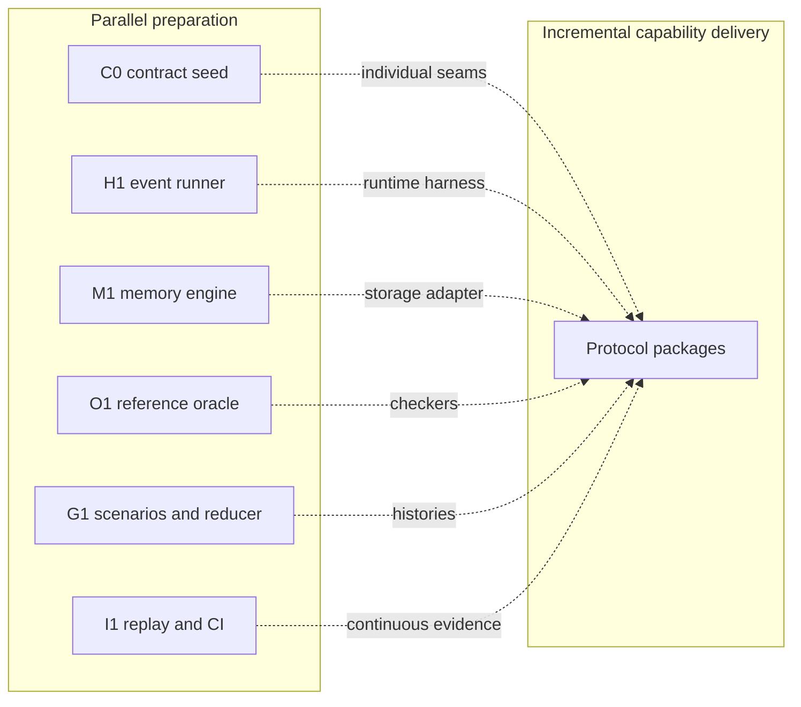
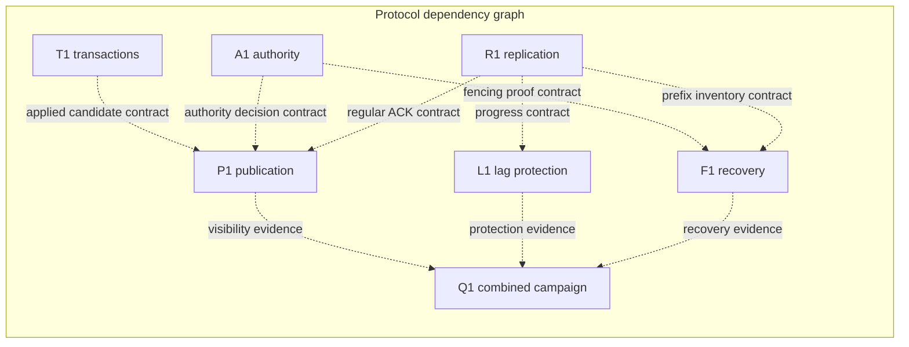
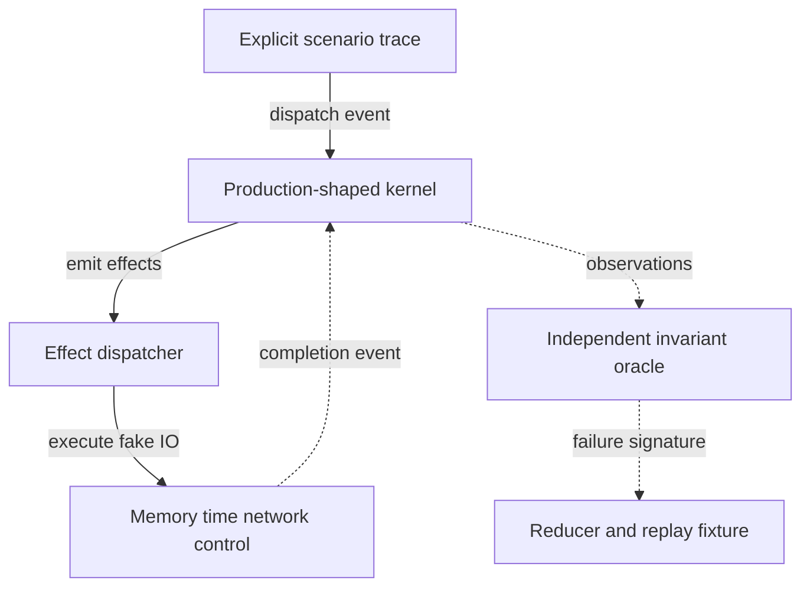
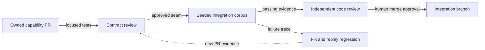
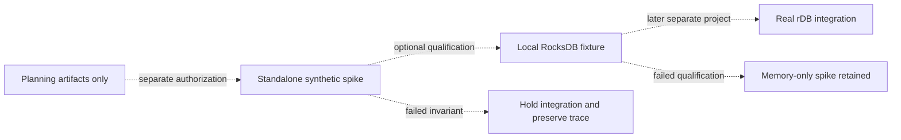

# Parallel correctness-spike implementation plan

**State: HANDOFF — implementation preflight**  
**AUTHORIZED FOR THE BOUNDED CORRECTNESS SPIKE ONLY**

User separately approved execution after accepting this plan. Authorization excludes production access, live rDB integration, external publication and merge. Checkboxes describe future work, not completed implementation; preflight found no Rust toolchain in this workspace.

**Goal:** exercise the real KV correctness kernel under fast, deterministic, arbitrary-topology simulation, then qualify a narrow RocksDB adapter.

**Architecture:** one standalone Rust crate beside rDB. Production-shaped protocol logic runs unchanged against in-memory storage, manual time, controlled transport and a fake control store. Thin runtime adapters execute explicit effects; they do not reimplement protocol decisions.

**Tech stack:** Rust; standard-library collections for the memory model; deterministic seeded generation; RocksDB behind an optional qualification feature. C0 pins the toolchain and dependencies before build claims; no buildable crate exists in this planning workspace.

## First screen

**Selected:** vertical correctness kernel, delivered through parallel, contract-owned PRs.

- **K1 — Start six packages together.** Do not wait for all contracts to freeze.
- **K2 — Contract readiness is per interface.** Production consumers activate when their own seam is reviewed.
- **K3 — Reuse the real kernel.** Fake IO, not transaction, fencing or recovery decisions.
- **K4 — Size by reviewable capability.** A few thousand code-and-test lines can be appropriate; LOC is not a quota.
- **K5 — Integrate continuously.** No final big-bang integration phase.



**Takeaway:** six substantial packages can start together; each consumer waits only for its named interface, not the whole first wave.

**Next decision:** resolve the missing Rust toolchain prerequisite. The bounded spike is authorized; production, merge and publication remain gated. Throughput budgets below are proposed targets, not measurements.

## 1. Scope and evidence boundary

### Included

- KV Put/Delete/Get; atomic conditions and mutations within one affinity group.
- Grants, fencing, generations, request dedup and publication barriers.
- Ordered replication, buffered versus durable progress, and lag protection.
- Unequal-prefix recovery, two-survivor operation and lone-survivor restrictions.
- Configurable nodes, partitions, core sets, regular copies and shadows in one process.
- Deterministic faults, replay, shrinking and narrow real-engine qualification.

### Excluded

- Real rDB control integration, live services, deployment and production data.
- Placement optimization, online move/split orchestration and actor execution.
- Structured document/collection/blob implementation and RocksDB Merge.
- Real-network transport, production async runtime and hardware performance claims.
- New distributed-consensus algorithms for the fake control store.

Arbitrary topology is test infrastructure, not permission to change the selected RF3 safety policy. Unsupported replica configurations must reject writes; small topologies exercise failure states.

**Inspected baseline:** design specification revision 1.6, developer handoff, validation plan and the pinned rDB evidence packet. `/workspace` is not a Git repository; only a partial pinned source snapshot is locally available. No current upstream checkout or compiled implementation was inspected for this planning pass.

**Source of truth:** [design specification](design-specification.md), especially §§5–8; [validation plan](validation-plan.md). This plan narrows delivery scope, not their safety contracts.

## 2. Parallelism contract

### PR rules

1. One package owns one path family. One PR includes implementation, tests and evidence for a coherent capability.
2. Shared-file changes go through their designated owner. Other packages propose contract changes rather than editing shared files concurrently.
3. Review a seam independently as soon as it is ready. C0 is not a global stop-the-world specification phase.
4. Tests and reference models may begin from this accepted design before a code interface exists.
5. No correctness assertion may be disabled to merge a partial package. Unwired behavior stays explicitly unavailable.
6. Each package writes failing tests first, implements its capability, then supplies focused and integrated replay results.

No fixed headcount or delivery dates are assumed. Experienced developers can split test modules inside a package, but each PR has one integration owner. Do not expand scope merely to keep more developers occupied.

### What really blocks what



**Takeaway:** authority, transaction and replication implementations proceed together; publication, protection and recovery can start their pure logic from reviewed seams before provider implementations finish.

Dashed arrows in this plan mean dependency/artifact delivery, not runtime calls. Integration requirements below distinguish **may start** from **may claim acceptance**.

## 3. Exclusive file ownership

**Proposed source root:** `<checkout-parent>/rdb-partition-spike/`; this is a location convention, not an existing directory. Every source path below is relative to that root and will be created only after authorization.

### Foundation paths

| Package | Exclusive files | Tests |
|---|---|---|
| C0 | `Cargo.toml`, `Cargo.lock`, `rust-toolchain.toml`, `src/lib.rs`, `src/contracts.rs`, `src/contracts/*.rs` | `tests/contracts.rs` |
| H1 | `src/sim.rs`, `src/sim/{scheduler,clock,network,control,cluster}.rs` | `tests/sim.rs` |
| M1 | `src/storage.rs`, `src/storage/{memory,crash_image,snapshot}.rs` | `tests/memory.rs` |
| O1 | `tests/support/oracle.rs`, `tests/support/oracle/*.rs` | `tests/oracle.rs` |
| G1 | `tests/support/scenarios.rs`, `tests/support/scenarios/*.rs`, `tests/fixtures/scenarios/*` | `tests/scenarios.rs` |
| I1 | `src/harness.rs`, `src/harness/{dispatch,trace,replay}.rs`, `tests/support/mod.rs`, `tests/harness.rs`, `.github/workflows/spike.yml` | `tests/replay.rs` |

### Kernel paths

| Package | Exclusive files | Tests |
|---|---|---|
| A1 | `src/authority.rs`, `src/authority/{grant,fence,resync}.rs` | `tests/authority.rs` |
| T1 | `src/transaction.rs`, `src/transaction/{conditions,dedup,batch}.rs` | `tests/transaction.rs` |
| R1 | `src/replication.rs`, `src/replication/{append,progress,catchup}.rs` | `tests/replication.rs` |
| P1 | `src/publication.rs`, `src/publication/{barrier,outcome,read}.rs` | `tests/publication.rs` |
| L1 | `src/protection.rs`, `src/protection/{age,admission,resume}.rs` | `tests/protection.rs` |
| F1 | `src/recovery.rs`, `src/recovery/{inventory,lineage,rebuild}.rs` | `tests/recovery.rs` |

### Qualification paths

| Package | Exclusive files | Tests |
|---|---|---|
| D1 | `src/rocks.rs`, `src/rocks/{batch,wal,prefix}.rs` | `tests/rocks_contract.rs` |
| Q1 | `tests/campaign.rs`, `tests/campaign/*.rs`, `tests/fixtures/regressions/*`, `docs/spike-results.md` | combined campaign |

C0 alone updates manifest features and module exports. Its initial seed predeclares the listed modules and test targets behind explicit unavailable handlers, so later packages need no new root export edits. I1 freezes the O1/G1 support-module registry at seed time; test roots can otherwise import package-local support directly.

I1 alone updates runtime dispatch; providers expose handlers rather than patching dispatch themselves. New qualification features remain off by default. The initial integration seed is a short real prerequisite for buildable package PRs, not a requirement to finish C0 before independent development starts.

## 4. Interface seams — reviewed individually

The following are **required contract shapes**, not claims of implemented Rust APIs. C0 owns concrete public type definitions and byte-vector fixtures. A breaking change requires affected consumer approval and a schema version change, not silent downstream edits.

### Core seams

| Seam | Required shape | Producer → consumers | Semantics |
|---|---|---|---|
| Event/effect | partition/node/boot IDs; correlation ID; kind; payload; event ID; logical time | C0 → H1/I1/all kernel modules | synchronous `step(state,event) -> effects`; all IO completions return as events |
| Time | monotonic tick; control-time estimate and error bound; timer ID/version; deadline | H1 → A1/L1/I1 | explicit reads; expiry/cancel races deliverable; stale versions are ignored |
| Storage | batch ID; generation/prefix; mutations/history/dedup; snapshot handle; flush ticket | M1/D1 → T1/R1/P1/F1 | atomic batch; completion distinct from durability; reads bind to a published snapshot |
| Control | expected revision; record key/value; CAS result; coherent snapshot revision; watch cursor | H1 → A1/F1 | one-record CAS; watch hints may gap; no fictitious multi-key transaction |
| Transport | sender/receiver/boot; authenticated-peer label; message ID; protocol/config version; bytes | H1 → R1/F1 | async delivery, not guaranteed ordering or uniqueness; forged identity is injectable and rejected |
| Trace | schema version; seed; generator version; config; ordered choices/events; oracle checkpoint digest | I1 → G1/O1/Q1 | replay by explicit event stream; seed alone is insufficient across generator versions |

### Kernel seams

| Seam | Required shape | Producer → consumers | Semantics |
|---|---|---|---|
| Authority decision | owner, epoch, grant ID, boot ID, generation, expiry, decision tick | A1 → T1/P1/F1 | recheck at admission, dispatch, publication and reply; deny on invalid uncertainty |
| Applied candidate | canonical transaction, before snapshot, new seq, digest, request result | T1 → R1/P1 | one unresolved transaction per partition; not client success |
| Replication result | peer role/boot, config/generation/epoch, contiguous seq and digest; buffered/durable class | R1 → P1/L1/F1 | only verified regular ACK can qualify; shadows never qualify |
| Publish/outcome | request identity, generation, seq, digest, outcome, published snapshot | P1 → API harness/O1 | post-apply ambiguity is `UNKNOWN_OUTCOME`; loss of reply does not undo publication |
| Admission state | required-copy set/config, oldest unsafe transaction, paused prefix, resume barrier | L1 → T1/P1 | unsafe age cannot reset via membership renaming |
| Recovery result | fenced prior owner, survivor inventories, selected lineage, new generation, mode, barrier | F1 → A1/R1/P1 | incompatible digests quarantine; no transaction-wise union |

All seams carry an explicit error variant and correlation identity. Version/identity/lineage failures reject or quarantine, not retry silently; transport/storage incompletion after apply remains ambiguous. Per-message idempotence derives from request, batch or sequence identity; no effect is retried with a fresh identity to hide an uncertain outcome.

C0 must copy and vector-test API request/result fields and remaining-duration deadlines from specification §5.1, ordered-path identities from §5.2, public errors from §5.4 and replication-envelope fields from §6.1. It must not invent a successful-response class weaker than primary plus regular-secondary buffered application.

## 5. PR work packages

**Quantum:** one reviewable capability plus its tests. Substantial PRs are expected, not mandated line counts. A package splits only if two separately acceptable capabilities have emerged; merge logistics must not become design sequencing.

### Execution checklist — unstarted

Foundation packages:

- [ ] C0 — contracts and crate boundary.
- [ ] H1 — deterministic environment.
- [ ] M1 — memory storage and crash images.
- [ ] O1 — independent logical oracle.
- [ ] G1 — scenario generation and shrinking.
- [ ] I1 — dispatch, replay and CI.

Kernel packages:

- [ ] A1 — authority and fencing.
- [ ] T1 — transactional KV and dedup.
- [ ] R1 — replication and progress.
- [ ] P1 — publication and outcomes.
- [ ] L1 — lag protection.
- [ ] F1 — recovery and rebuild.

Qualification packages:

- [ ] D1 — optional real-engine conformance.
- [ ] Q1 — combined adversarial campaign.

### Foundation packages — all may start together

| ID | Deliverable and acceptance | May start with | Acceptance requires |
|---|---|---|---|
| C0 | Compileable crate contracts; known-answer identity/envelope vectors; unknown mandatory versions refused; dependency/toolchain pins | selected specification | its contract tests and consumer seam review |
| H1 | Stable event queue; manual clocks/timers; controllable network; fake CAS/watch control; configurable cluster. Same event log yields identical trace; stale timer and watch-gap cases pass | scenario/event shapes in §4 | C0 event/control/time seams + H1 tests |
| M1 | Ordered in-memory engine, atomic batch, snapshots, buffered/durable crash images. Every injected boundary yields whole batch or none; snapshot never observes partial state | storage requirements in §4 | C0 storage seam + memory tests |
| O1 | Small independent KV/history oracle for atomicity, publication, authority, lineage and dedup. Deliberately bad traces trigger each checker; valid restricted-loss traces do not | specification invariants | C0 trace vocabulary + oracle tests |
| G1 | Seeded topology/workload/fault generators and causality-preserving reducer. Failure retains its signature after shrinking; minimized trace explicitly replays | scenario grammar below | C0 trace format + G1 unit tests; I1 runner for end-to-end replay |
| I1 | Dispatcher, canonical trace/replay, feature-independent CI and evidence reports. No live IO reaches core tests; unregistered handlers fail explicitly | event/effect shape | C0 + H1 contracts; initial harness tests |

Each foundation PR may use fixtures inside its own test paths. Fixture implementations are not allowed to redefine the production protocol.

### Kernel packages — implementation can proceed in parallel

| ID | Deliverable and acceptance | May start with | Acceptance requires |
|---|---|---|---|
| A1 | Grant/fence state machine and coherent watch resync. Expired/old-boot grants deny; pause/suspend and clock-bound violation fail closed; CAS races have one winner | C0 authority/control seam | H1/I1; fencing scenarios |
| T1 | Conditions, Put/Delete, atomic batch and retained request outcomes. Same request has one effect; changed payload rejects; different affinity rejects; local apply never returns success | C0 transaction/storage seam | M1/I1; fake authority and completion fixtures |
| R1 | Canonical append, ancestry validation, independent copy progress and catch-up. Duplicate append idempotent; gap/digest mismatch rejected; lost/malicious ACK cannot advance progress | C0 envelope/transport/storage seam | H1/M1/I1; replication cases |
| P1 | Publication barrier, old-prefix snapshots, reads/status and uncertain outcomes. Late ACK revalidates authority; post-apply timeout freezes only its partition; lost reply remains queryable | C0 + reviewed A1/T1/R1 seam shapes; providers may be incomplete | A1/T1/R1/M1/I1 integrated path |
| L1 | Unsafe-age admission and durable resume state machine. Warn at 1 s, pause by 2.1 s under virtual scheduling bound; exact barrier plus 5 s hysteresis required | C0 progress/time seams; R1 reviewed shape | H1/R1/I1; integrated P1/T1 admission tests |
| F1 | Compatible longest-prefix recovery; two-survivor synchronization; lone-survivor read-only and three-copy rebuild barrier. Divergence never auto-merges | C0 + reviewed A1/R1 recovery shapes | A1/R1/M1/I1 and P1 read barrier |

### Qualification packages — overlap instead of waiting for all features

| ID | Deliverable and acceptance | May start with | Acceptance requires |
|---|---|---|---|
| D1 | Optional RocksDB adapter and shared storage contract suite. Atomic batch, published snapshot and durable-watermark cases match M1 where semantics overlap | reviewed C0 storage seam; runs separately from core tests | M1 conformance fixtures; pinned native dependency and local-build approval |
| Q1 | Combined safety campaign and coverage matrix. Zero invariant violations in 10,000 seeded histories; every required fault boundary exercised; mutations caught | accepted scenario grammar and O1 invariants | H1/M1/I1/O1/G1 plus the kernel packages exercised |

Q1 builds adversarial cases while features are developed. It does not start after feature completion. D1 may develop storage-only tests early; full atomic-prefix recovery evidence waits for the necessary kernel paths.

## 6. Test architecture and scenario grammar

### One kernel, replaceable environment



**Takeaway:** the simulator controls IO completion and time; it does not contain a second implementation of the kernel under test.

### Scenario operations

| Group | Operations | Required boundary cases |
|---|---|---|
| Clients | submit, read, status, retry | changed digest; old generation; lost success reply; retained and expired dedup |
| Network | deliver, drop, duplicate, reorder, partition, heal | stale boot/epoch/config; missing predecessor; ACK after revocation |
| Time | advance, fire, cancel, expire, pause, resume | same-tick orders; grant skew within and outside ±100 ms assumption; 24 h dedup via jumps |
| Storage | complete batch, fail batch, flush, crash, reopen | before/after each atomic boundary; no false durable watermark |
| Control | CAS, emit watch, gap, compact, reload | stale snapshot; lost control quorum; invalid grant; partial staged metadata |
| Recovery | inspect survivors, select prefix, synchronize, rebuild | all unequal secondary prefixes; all lone-survivor choices; divergence; returning stale owner |

Logical event order must never depend on wall clock, random hash-map traversal, thread scheduling or an unrecorded random call. Equal-time events have stable IDs; generated schedules explicitly vary their order. Jump directly to the next deadline rather than ticking through idle milliseconds.

### Storage realism without disk

M1 separates process-visible batches, modeled OS-buffered WAL and verified durable prefixes. A process crash can differ from a host/power crash; a host crash may discard every unflushed suffix. Missing/corrupt durable data is an explicit fault leading to quarantine, not an invented successful recovery.

The storage seam includes `sync_wal_through(captured_prefixes)`. M1 models, and D1 enforces, the per-engine write-order mutex from capture through successful `DB::flush_wal(true)` after captured batches return. No write bypasses this boundary; errors or partial completion advance no durable watermark.

D1 tests concurrent-write attempts, flush errors, crash/reopen and rejection of manual/concurrent/pipelined WAL modes unless separately requalified. Batch atomicity holds across user values, history, dedup and progress metadata. Crash hooks fire before/after the atomic commit and each completion, flush and publication boundary. A test must never use "durable" as an alias for in-memory application.

### Mandatory cross-package adversarial cases

- **A1/P1:** expire authority between publication and reply. Delayed old dispatch after pause/reboot/new-generation activation may leave quarantined bytes, never active-lineage publication, ACK, export or replication.
- **F1/R1:** query reachable eligible prior regular members and verified shadows within the 2 s discovery window. Extend while a higher compatible prefix transfers; record source failure before choosing a shorter prefix and preserve loss uncertainty.
- **F1/T1/P1:** retain old-generation status mappings for 24 h. Retained requests may return `RECOVERED_APPLIED`; lost/absent history returns `UNKNOWN_OUTCOME`, expired retention `STATUS_EXPIRED`, never proof of nonexecution.
- **F1/T1:** cover same/different request digests before/after recovery and expiry. Mutating retries require generation reconciliation even when status remains queryable.

These cases are acceptance requirements for the named packages and Q1, not optional later scenarios.

### Oracle independence and controlled liveness

O1 compares client-visible logical state and declared lineage, not internal tree or batch shapes. It must not import T1/R1/F1 algorithms. Majority-loss rollback is checked against the declared generation and surviving prefix, not an impossible global no-loss oracle.

Safety must hold under arbitrary faults. Liveness checks require an explicitly healed, fair delivery schedule and valid authority; they have a bounded event count. An unhealed partition or endless message dropping is not a liveness failure.

Single-process deterministic scheduling does not qualify real multi-thread memory races, FFI, filesystem or suspend-clock behavior. Those remain separate adapter/platform gates.

## 7. Validation and fast-feedback budgets

Budgets below are **proposed acceptance targets**, not previously observed speeds. Measure warm release builds on one recorded CI worker; exclude compilation from execution timing and report it separately. If thresholds fail, improve the harness or explicitly revise the budget—never reduce assertions silently.

### Feedback layers

| Layer | Target | Required evidence |
|---|---|---|
| Focused PR tests | ≤10 s execution per package | test names, cases, assertions, runtime and allocation summary |
| Integrated PR corpus | 1,000 bounded histories, ≤60 s | max 2,000 events/history, seed list, event count and zero invariant failures |
| Extended spike gate | 10,000 bounded histories, ≤10 min | same bounds; scenario coverage; every failure replayed or resolved |
| Long stress | separately budgeted CI job | explicitly bounded memory/events; no unbounded combinatorial search |
| RocksDB conformance | separate slower job | shared cases; engine/version/OS; reopen results; no power-loss claim |

The previous verbal "millions of steps" and "thousands of histories" expectations were not measurements. This plan replaces them with bounded, reproducible budgets.

### Safety checks

| Property | Acceptance threshold | Validation-plan mapping |
|---|---|---|
| Atomic KV and lineage | zero partial transactions, no invented prefix | V1 simulated; D1 adapter subset |
| Fencing | no overlapping authoritative acceptance within modeled assumptions; violated assumptions fail closed | V2 model only |
| Recovery and retry | correct compatible prefix and generation; no duplicate retained-request effect | V3/V4 simulated |
| Lag protection | warn 1 s; pause ≤2.1 s; required durable barrier; 5 s healthy resume | V8 simulated |
| Compatibility | unknown mandatory versions fail before apply | V12 message/record subset |
| Multi-partition isolation | blocked partition does not block other partition progress under fair scheduling | executor correctness extension |

### Coverage that measures more than test count

Report transition/guard outcomes, fault-boundary hits and pairwise fault combinations. Include mutation checks that deliberately accept stale authority, count a shadow ACK, publish before ACK, skip ancestry or mark buffered data durable. Every such mutation must be caught by a named test; percentage coverage alone cannot waive a missing invariant.

Placement V5/V9, actors V6, physical performance V7/V10/V11 and value V13–V15 remain outside this slice. Full V1/V2/V8/V12 remain pending where hardware, real adapters or platform behavior are required.

### Proposed future commands

These are acceptance commands for files C0/I1 will create, **not executed commands or existing tests**. All use the standalone crate root; test names map exactly to the ownership tables.

```bash
cargo test --release --test sim --test memory --test oracle --test scenarios --test replay
cargo test --release --test authority --test transaction --test replication
cargo test --release --test publication --test protection --test recovery
SPIKE_SEEDS=1000 SPIKE_MAX_EVENTS=2000 cargo test --release --test campaign
SPIKE_SEEDS=10000 SPIKE_MAX_EVENTS=2000 cargo test --release --test campaign
cargo test --release --features rocksdb-adapter --test rocks_contract
```

Each package also runs its single `--test` target during development, first demonstrating its expected failure. I1 makes unknown environment/config fields errors and records resolved budgets in the result manifest. A failing seed exits nonzero and writes schema-versioned events, workload/config and a minimized reproducer under `validation/<run-id>/`.

## 8. Continuous integration and review



**Takeaway:** independent package development feeds one tested integration branch; a dispatched test or submitted PR is not completion.

Integration dispatch is owned by I1 and evolves as each handler becomes available. A temporary explicit unavailable result is permitted for an unimplemented capability; a fake success is not. Feature flags may isolate unfinished real adapters, never bypass core safety checks.

Review evidence includes focused tests, relevant invariant corpus, seam version/diff and retained failures. PR descriptions distinguish in-memory proof, adapter observations and untested platform assumptions. Merge, external publication and implementation still require the corresponding human authority and independent review.

## 9. Coexistence, rollback and dependencies

### Coexistence and rollback



**Takeaway:** the spike never replaces rDB or serves live traffic; failures stop integration without migrating user data.

No backfill, traffic cutover or schema migration occurs in this slice. Local engine-format experiments use disposable synthetic fixtures with recorded versions. Never open an existing rDB database or silently downgrade a fixture.

On an invariant failure, I1 stops the integration gate immediately and preserves seeds/traces. The integration owner reverts or disables the offending optional capability only after review; stopping the gate is immediate, while repair has no promised duration. Fixture deletion is not an automatic rollback step.

There is no authorized irreversible cutover. The first potential irreversible action would be writing live data or migrating an existing database; that is explicitly excluded and requires a new plan and approval.

### External dependencies and open decisions

| Dependency / decision | Owner | Needed by | Default / gate |
|---|---|---|---|
| Standalone repository root and crate name | user + C0 | execution setup | proposed `rdb-partition-spike`; create nothing before authorization |
| Rust toolchain, property-test and digest versions | C0 | contract PR build | pin reproducibly; no network/install implied by this plan |
| CI worker resource budget | I1 + project owner | speed qualification | record CPU/RAM; proposed targets stay unverified |
| Supported RocksDB/native toolchain | D1 | optional adapter job | use source evidence as candidate only; keep feature off until qualified |
| Fencing clock model and conservative grant algorithm | A1 + architecture owner | authority seam review | follow spec; block automatic promotion on ambiguity |
| Real rDB CAS/watch/grant integration | later project | after this spike | deliberately excluded; fake is not certification of rDB |

## 10. Review and evidence appendix

### Why this structure

| Driver | Selected parallel vertical kernel | Layer-by-layer | Full duplicate model |
|---|---|---|---|
| Concurrent start | six independent preparation packages | narrower layer dependencies | two large streams |
| Early integration | continuous per-seam wiring | later | later model/kernel comparison |
| Oracle diversity | independent small logical checker | often mocked peers | strong but costly second semantics |
| First-slice size | bounded KV correctness | can overbuild storage | duplicates implementation effort |

These are planning inferences, not measured productivity differences. The user selected the vertical structure and requested parallel work. The plan changes if interface churn or integration evidence shows the proposed seams cannot be independent.

### Evidence ledger

| Claim | Source / class | Dates and depth | Fit / limit |
|---|---|---|---|
| Buffered ACK, publication, fencing and recovery contracts | design-specification.md §§5–8; PROJECT-ARTIFACT | revision 1.6; read during this planning pass; access 2026-09-20 | normative project design, not executed proof |
| Gate numbers and thresholds | validation-plan.md §§2–3; PROJECT-ARTIFACT | no revision date shown; read 2026-09-20 | planned tests only |
| rDB has inspected CAS/watch surfaces; built-in leases unverified | evidence/rdb-primitives-followup.md F1–F5; PROJECT-ARTIFACT | packet and access 2026-09-20; fetched-and-read local evidence packet | pinned source findings only, not current upstream or runtime proof |
| Fast deterministic memory tests, manual timers, standalone crate and arbitrary cluster | user selections in this conversation; PROJECT-ARTIFACT | observed during current planning interaction | approved planning requirements, not implementation permission |
| Parallel packages improve useful concurrency | dependency and ownership tables above; inference | authored in this plan | conditional on seam stability; no headcount/velocity promise |

The ADR/planning format is a project convention, not a normative architecture method. Reviewer judgments do not establish performance or statistical independence.

**Remaining risks:** memory-model optimism; shared contract churn; oracle correlated bugs; unmeasured feedback speed; real-clock/engine behavior; unsupported future control integration. Named package owners and gates above make each risk observable.

**Review record:** [planning checks and reviewer findings](evidence/parallel-spike-plan-review.md).

**Outcome:** READY_FOR_REVIEW of the plan. No implementation or validation campaigns have run. Smallest next action: review the parallel package boundaries, then separately authorize the bounded spike if desired.
