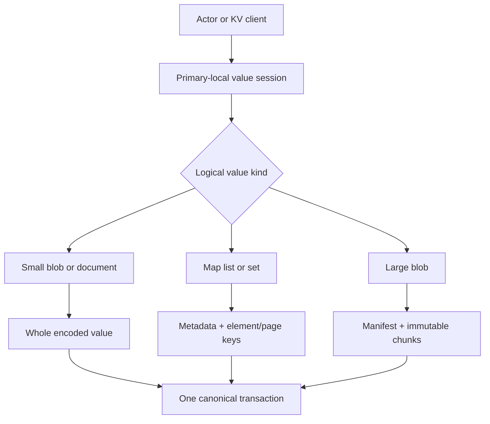
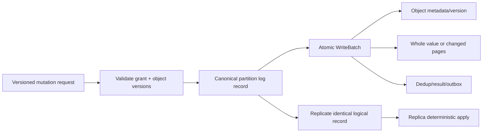

# Value layer decision review

**State: REVIEW_WITH_USER**  
**Status:** Provisional recommendation. Not yet selected.  
**Date:** 2026-09-20

## First screen

**Provisional recommendation — high confidence:** use a **hybrid value model**.

- Whole encoded values for small blobs and documents.
- Independent keys/pages for maps, lists, sets, and large actor state.
- Chunked immutable storage for large blobs.
- Canonical versioned mutation envelopes for replication and recovery.
- RocksDB Merge only for narrow, proven mutation families. Not for universal JSON updates.

**Takeaway:** one API model uses different physical shapes, while one transaction and replication contract preserves correctness.

## Decisive Key Dots

1. **V1 — Local execution.** Actors and structured-value code run only on the granted partition primary.
2. **V2 — Atomic boundary.** One affinity group may contain many independently addressed objects, changed in one partition transaction.
3. **V3 — Types.** Logical values support binary blobs, flexible extended-JSON documents, and schema-versioned typed actor state.
4. **V4 — Versions.** Every object mutation requires an expected object version. Collection metadata and changed entries commit atomically.
5. **V5 — Size classes.** Inline values remain bounded. Large blobs use immutable chunks and a manifest. The selected planning maximum is 256 MiB per logical blob.
6. **V6 — Collections.** Maps/sets use stable element keys. Lists use stable element IDs plus ordered pages or rank labels; array-index shifting must not rewrite the entire list.
7. **V7 — Replication.** Replicate a canonical application mutation envelope, not RocksDB WAL bytes or opaque engine-specific merge operands.
8. **V8 — Merge evidence.** RocksDB Merge can defer JSON-like incremental updates. It moves work to reads/compaction and binds stored data to callback semantics.
9. **V9 — Safety.** Merge does not enforce expected versions, primary fencing, transaction isolation, or replica ordering.
10. **V10 — Evolution.** Operand and value formats carry immutable version IDs. Readers retain old decoders until all dependent data and snapshots are retired.

## Quality scenarios

| Scenario | Measurable response |
|---|---|
| Change one field in a 1 MiB document | No correctness loss; compare whole rewrite, delta materialization, and split-object cost at p99 |
| Update one entry in a 100k-item map/list | Bytes written scale with changed entry/page, not the full collection |
| Read hot actor state | Meets the existing ≤5 ms local p99 target under declared workload; no unbounded operand replay |
| Crash during multi-object actor update | Recovery exposes all or none of the transaction at a declared partition prefix |
| Promote a replica with retained deltas | Same object bytes/version as reference replay; unknown formats quarantine rather than guess |
| Roll forward/back across format versions | Mixed-version readers reject unsupported mandatory formats before apply |

## Options

| Option | Strength | Cost / risk | Verdict |
|---|---|---|---|
| A. Whole values only | Simplest | Large documents and collections amplify writes | Keep as small-value baseline |
| B. Universal RocksDB Merge | Small foreground deltas | Variable read/compaction cost; callback compatibility; weak fit for version preconditions | Reject as universal layer |
| C. Explicit mutation log + materialized objects | Clear replication, replay, audit | Materializer and retention complexity | Use as canonical protocol |
| D. Hybrid physical layout | Efficient across value shapes | More codecs and storage paths | **Provisional choice** |

## Proposed storage contract

**Takeaway:** validation happens before the batch; data, metadata, and transaction bookkeeping commit together; replicas replay the same logical operation.

### Proposed initial limits

These are design defaults requiring measurement:

| Item | Proposed v1 limit |
|---|---:|
| Inline encoded value | 1 MiB |
| Whole-document preferred target | ≤256 KiB |
| Single logical blob | 256 MiB |
| Blob chunk | 1 MiB |
| Transaction encoded request | existing 1 MiB limit |
| Collection mutation | bounded changed entries/pages within transaction limit |

A 256 MiB blob cannot be sent as one existing 1 MiB transaction. Upload chunks idempotently first. Then atomically publish the manifest/reference. Unreferenced chunks are later garbage-collected after retention and safety checks.

## Merge boundary

Allow RocksDB Merge only when all are true:

- A reference materializer defines exact semantics.
- Ordered replay is deterministic.
- Permitted partial merging passes property tests.
- Operand count and bytes are bounded.
- Old operand decoders survive upgrades.
- p99 reads and compaction remain within validated budgets.

Initial candidates: counters, min/max, and append of immutable-ID entries. JSON path updates remain explicit canonical mutations and normally materialize through Put or split-object updates.

## Evidence

Detailed verified source analysis: [RocksDB Merge evidence](evidence/rocksdb-merge-analysis.md).

**What would change the recommendation:** realistic benchmarks showing a generic Merge operator beats explicit materialization across document, collection, recovery, and upgrade workloads without violating p99 or operational bounds.
